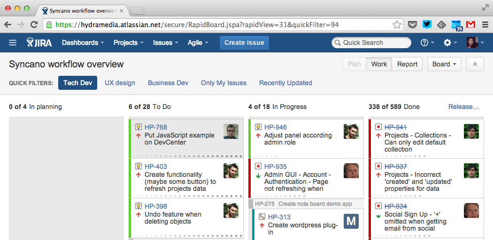
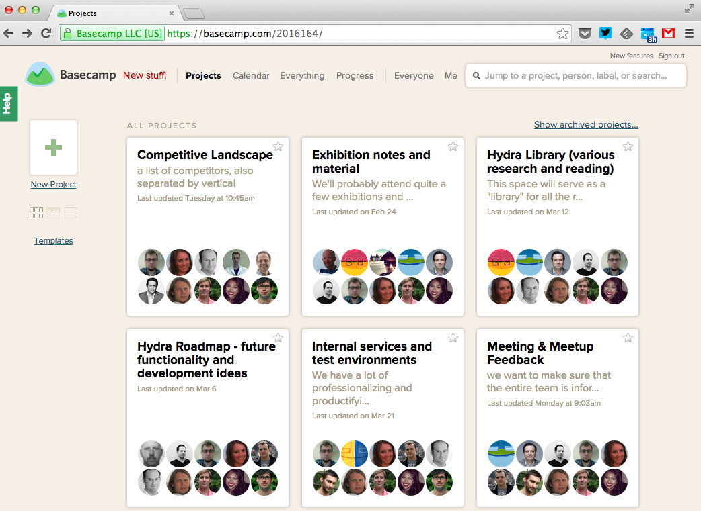
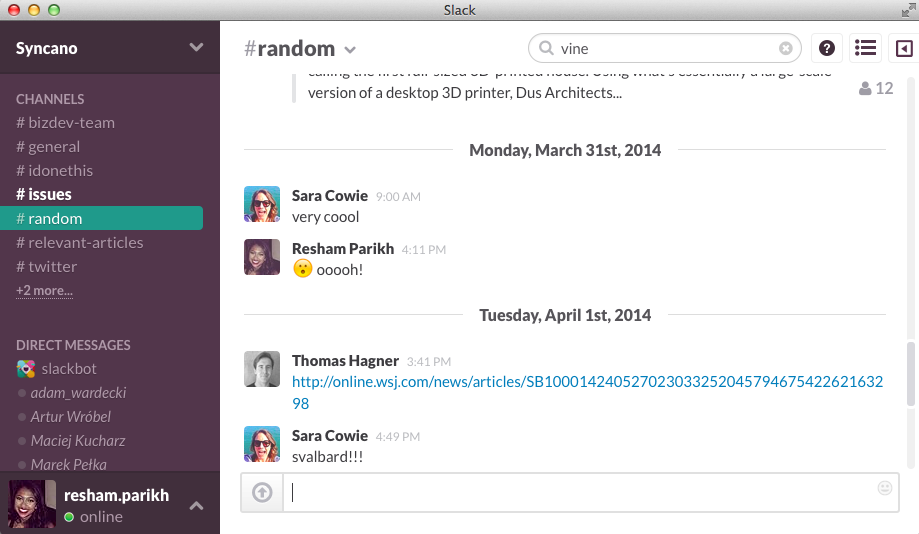

Our team at Syncano is distributed across three international cities – New York, Oslo, and Warsaw – so we’re always looking for the best tools to stay connected and productive. Though we’re still experimenting with new and improved channels for communication, here are three apps we're loving.<!--more-->

<b>Jira</b>

<a title="Jira" href="https://www.atlassian.com/software/jira" target="_blank">Jira</a> helps us keep track of our projects, goals, and accomplishments - no matter which office we're in. We’re able to create different dashboards for different teams, assign projects to team members, and track the progress of that project. When any team member finds an issue on the website, for example, they can easily post it onto Jira and track it to its completion.

<b>Basecamp</b>

When you're not in the same office as your team, it's great to have a central place for project-related discussions. With <a title="Basecamp" href="http://www.basecamp.com" target="_blank">Basecamp</a>, we’re able to organize conversations into separate project folders and keep track of each conversation on our own timeline.  Team members choose whom to email on each post – but you can always view the entire thread on the web even if you’re not notified because discussions are stored and searchable forever. That way you're always in the loop!

<b>Slack</b>

We recently discovered <a title="Slack" href="http://www.slack.com" target="_blank">Slack</a>, and we love it. All  messages, files, and photos sent through Slack can be organized by topic and searched for. Slack integrates with up to 5 other applications like Google Docs, Twitter, and Jira, and it has an easy-to-use mobile app. It sends real-time desktop notifications and email notifications for messages you haven’t read yet (which we definitely appreciate). Plus, it's UX/UI is great.

What are some apps your distributed team uses and why? Let us know in the comments below!

<em>Photo credit: Oslo - <a href="https://www.flickr.com/photos/sigurdr" target="_blank">Sigurd Rage</a>, Warsaw - <a href="https://www.flickr.com/photos/radekkolakowski/" target="_blank">Radek Kolakowski</a>, New York -<a href="https://www.flickr.com/photos/shankbone/" target="_blank"> David Shankbone</a>
</em>