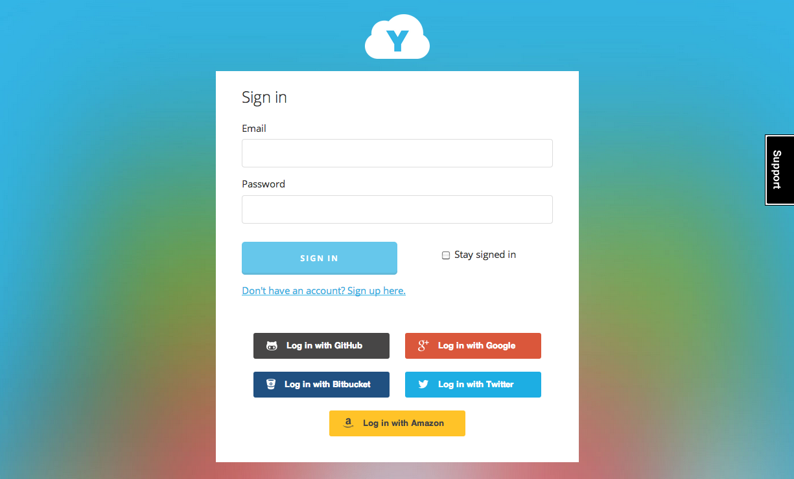
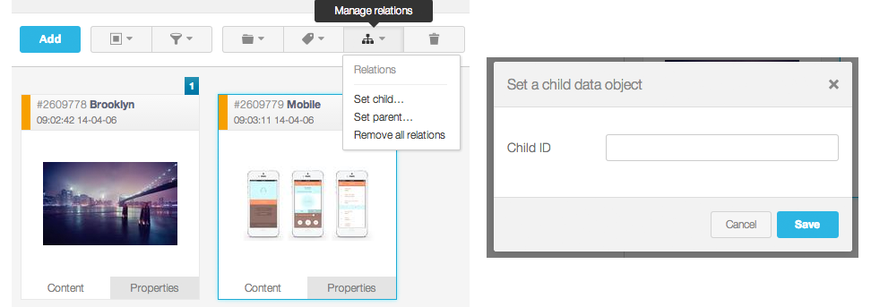
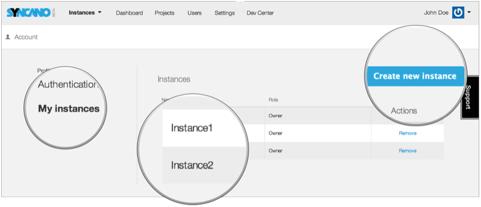
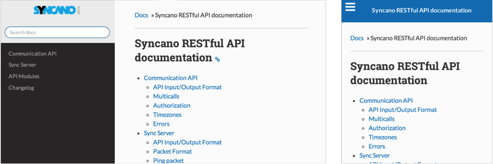
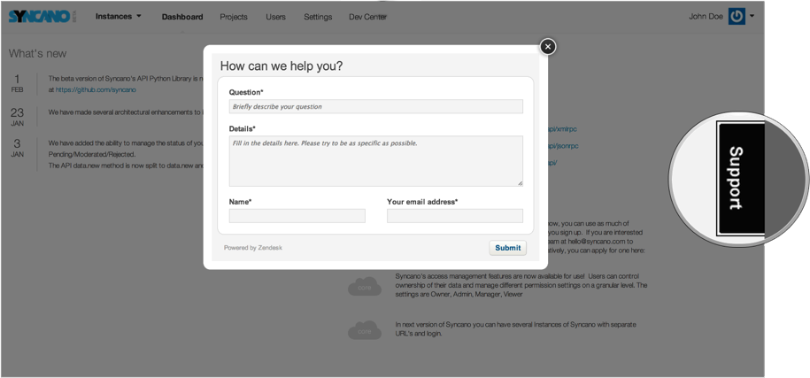

We’re excited to open Syncano to the public for the first time with version 3.1! While we’re still in beta, we feel this new version is a huge accomplishment equipped with a simplified sign up process, completely re-invented admin GUI, new API functionality, and easier access to support. Here are some of our key new features:<!--more-->

<h2>Simplified Login and Social Media Authentication</h2>

You no longer need a code to sign up, and we've added social media authentication so you can quickly register and log in with Github, Google, Amazon, Bitbucket and Twitter. (You can manage all of your social media connections by going to <em>Account</em> > <em>Authentication</em> in your admin GUI.)

<h2>Redesigned and Improved Admin GUI Panel</h2>

We’ve completely recreated the Admin GUI from the ground up to make it simpler, easier to use, and up to 30 times faster. In addition to a new look and feel, we’ve added a settings tab, the ability to create and manage multiple instances, a drag and drop photo uploader, and a simple way to add parent-child relationships to data objects.

Through the "Settings" tab, you can manage the administrators of your instance and generate API keys for your applications. Additionally, you can now create up to 10 instances per user by going to <em>Account > My Instances</em> and clicking "Create new instance."

<h2>Faster Notifications and Improved Data Subscriptions</h2>

Fast data syncing is one of the most important features for next generation applications designed for multiple platforms, so we doubled the speed of all notifications and data subscriptions.

Instead of subscribing to data continuously, your app will now subscribe to data in sessions - increasing app performance and decreasing load time and energy usage. You can also have multiple connections and subscriptions running at the same time.

<h2>New API Documentation</h2>

Our <a href="https://login.syncano.com/docs/rest/" target="_blank">new API documentation</a> includes an easier-to-use look and feel with a more advanced Python library. It's also fully responsive and mobile friendly. Soon, we'll also release three new libraries (Andriod, iOS, and JavaScript).

<h2>“Support” Tab For Fast rontact with Syncano</h2>

We’ve added a “Support” tab on the right side of each page so you can easily contact us whenever you need us.

As always, we're interested in hearing your feedback so don't hesitate to sign up here and contact us with inquiries or thoughts about the platform.
