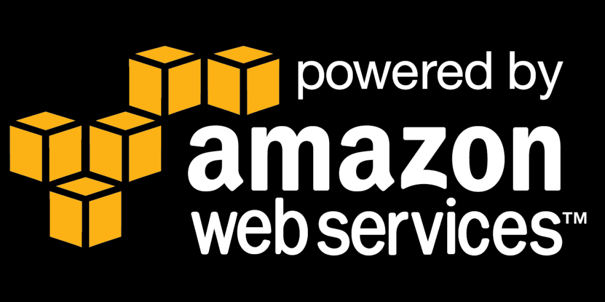
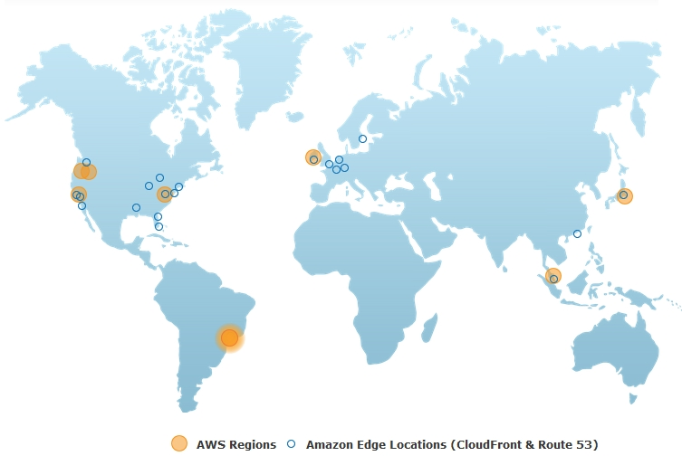
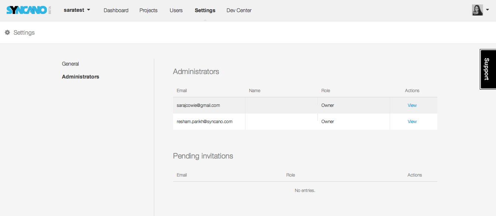
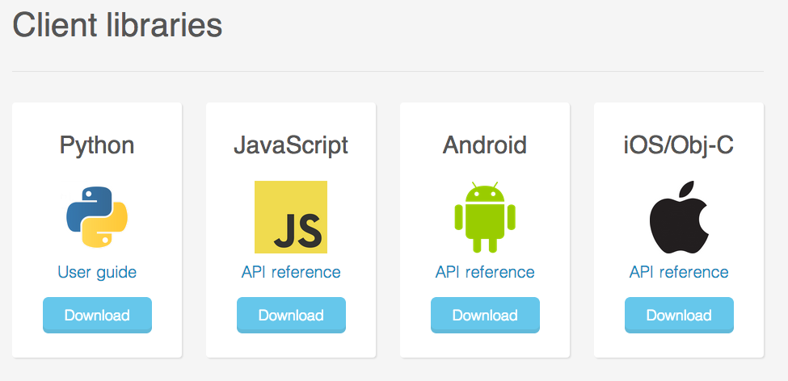
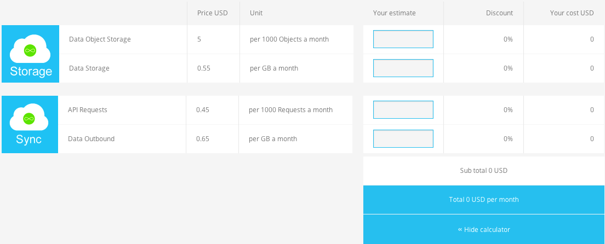

A good backend solution will ensure your data is secure, reliable, and seamlessly integrated within all of your applications. Here are the top six things we took into account when we built ours.<!--more-->

<h2><strong>Scalability</strong></h2>

Scalability is essential for anyone using a backend service provider. Your storage should be able to grow as your business grows, so a platform should give you access to more than enough server space to account for unforeseen data surges. We built Syncano on top Amazon Web Services (AWS) because of its unlimited capacity.

<h2><strong>Data Security</strong></h2>

Security is of utmost importance to most developers. We think users should have full confidence in their platform’s ability to keep their data safe, so we protect all of the data on our platform with two-key encryption - a method that requires knowledge of two separate keys to access any piece of data.

Servers can also be affected by natural disasters, so a Backend as a Service (BaaS) provider with access to multiple data centers can be important. AWS, for example, has storage centers all over the world, so any data stored on our platform can be easily protected if a natural disaster were to occur.

<h2><strong>Strong Customer Service and Technical Support</strong></h2>

Readily available technical support can be a deal -maker or -breaker when it comes to a BaaS provider, so we’re big fans of live chat features and quick response times to customer emails. You can often check response times by sending inquiries through a company’s “contact us” page. If you don’t get a response within 24 hours, we’d say you should move on!

<h2><strong>Ability to Control Who Can Access Your Data</strong></h2>

The biggest benefit of cloud storage is having access to your data whenever and wherever you need it. You should expect to be able to control who can access to your cloud resources at a granular level and have the option to move your data to internal servers or to another platform should you chose to. We’re strong believers that no company should coerce you to continue to use their platform by making leaving difficult, so we’re implementing a way to easily port your data into our out of our platform.

<h2><strong>APIs and Multiple Libraries</strong></h2>

With more and more applications being created every day, product developers and startups don’t have the time and resources to create backend systems. A backend that’s simple to use but still provides both storage and access to the complex technology that you need for your application can be a huge time and money saver. We’ve spent over two years building an extraordinarily fast and simple user experience for what would normally be a complex backend, equipped with a full user guide and multiple libraries.

<h2><strong>Upfront Pricing</strong></h2>

Finally, any platform that charges you high rates up front could be a scam, so look for pay-as-you go platforms that only charge you for what you use. We like to keep a<a href="http://www.syncano.io/pricing/"> pricing calculator </a>on our site so you can see exactly how much it will cost to use our platform.

