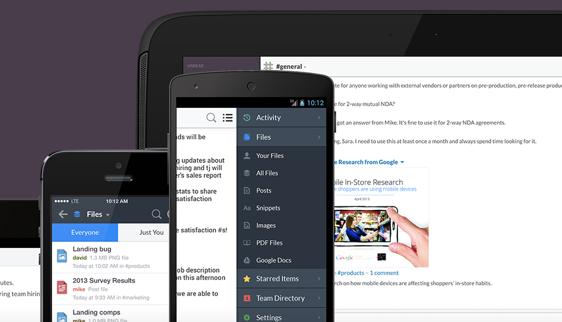
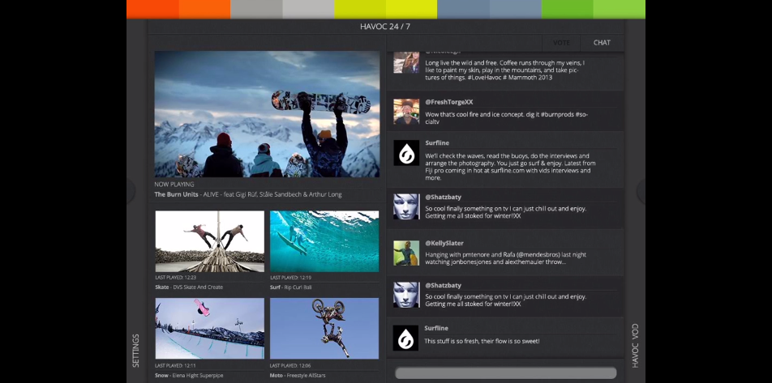
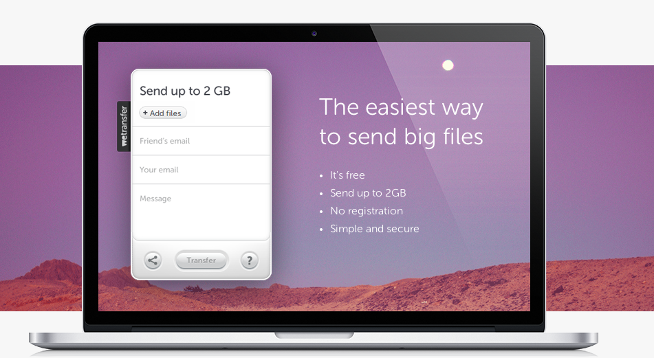
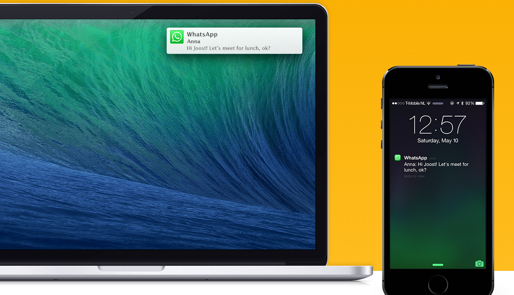
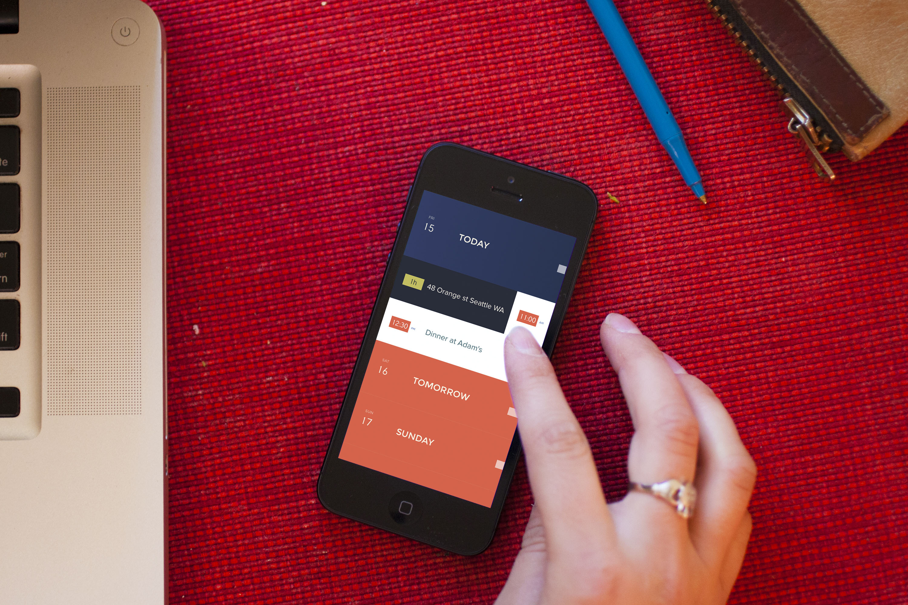
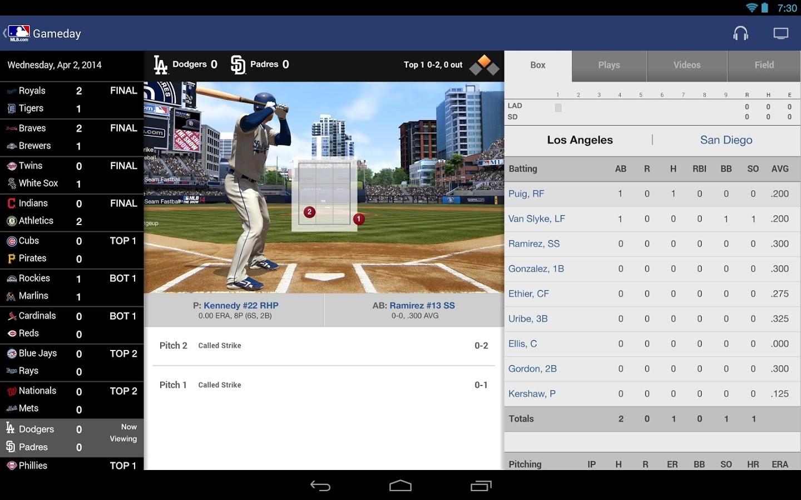

As we use more and more devices, we need apps that seamlessly integrate them into our lives. From collaboration tools for businesses to second screen apps for entertainment, we’re seeing a new generation of beautiful, powerful apps that use real-time sync for incredible user experiences. Here are six gorgeous apps that show the capabilities of real-time technology.

## **1\. Slack**

[This team chat and file sharing app](http://www.slack.com) has taken off among collaborative teams for good reason: Slack is beautifully sleek with an interface that is as fast and simple as it is empowering. Members of a team can chat as a group, use hashtag feeds, or send direct messages all with seamless integration across any device.

## **2\. Havoc 247**

 We're lucky to have had a sneak peak of this real-time second screen app by Havoc 247, [an innovative television network ](http://havoc.tv/havoc-247/)on AT&T U-verse. Powered by Syncano’s patented real-time technology, the app allows viewers to live-stream broadcasted content from any device while interacting with friends and voting for the next show. Havoc 247 also makes innovative use of Syncano's technology by letting users shop products related to what they’re watching. The app is expected to go live this year.

## **3\. WeTransfer**

 [This photo and video sharing app](https://www.wetransfer.com/) simply does what it does—with a gorgeous design but no bells and whistles tripping up performance. Real-time sync allows for blazing fast sharing of files up to 2 GB on your phone or mobile device. As soon as you open WeTransfer, you’re immediately able to choose the file you want to share and enter the recipient’s email address. You're automatically subscribed to notifications of files sent and files available to download, and there’s nothing cumbersome to manage.

## **4\. NotifyR**

 If you're an Apple user, [this app's real-time sync technology](http://www.getnotifyr.com/) will let you synchronize notifications between your computer and iPhone. You don’t have to juggle devices while working, and you'll never miss a text. Messages, Snapchat pictures, phone calls, and more will show up as an unobtrusive native notification in the corner of your computer screen.

## **5\. Peek Calendar**

 Visualizing your schedule doesn’t get easier than this. [Peek Calendar](http://www.peekcalendar.com/) offers iPhone users a quick look at all your upcoming events, including real-time integration of everything you have entered in your iPhone events. Peek uses a beautiful, minimalist design that reflects the app’s focus on making it easy to access your information and manage your schedule.

## **6\. MLB.com At Bat**

 Sports fans love real-time apps for checking stats and scores on the go. [MLB.com At Bat](http://mlb.mlb.com/mobile/atbat/) also lets paid subscribers watch live baseball games, with surprisingly high-quality live video feeds, streaming radio, and access to highlight clips and analytics. At Bat also powers real-time push notifications for scores and news.
