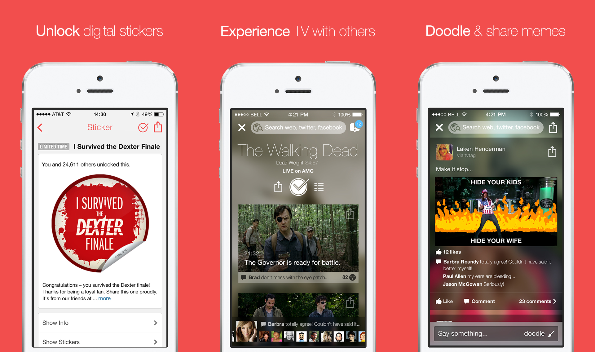
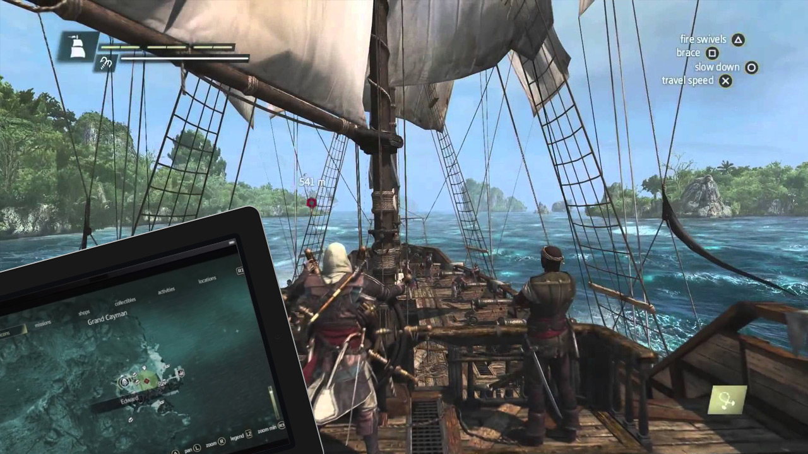
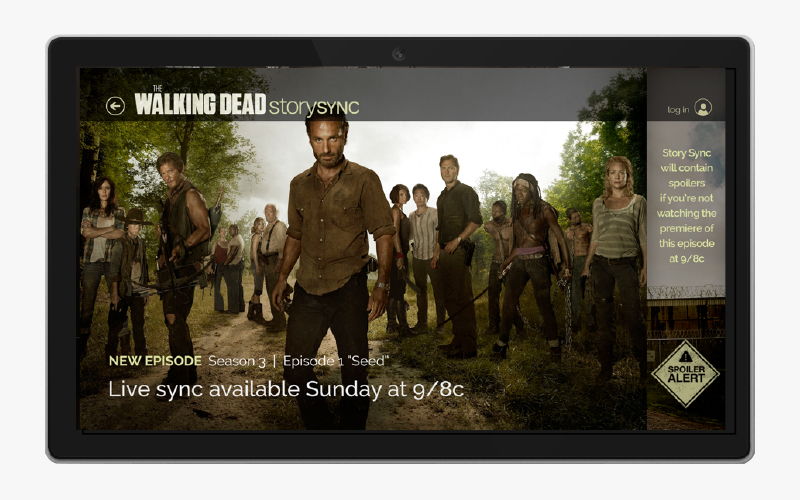
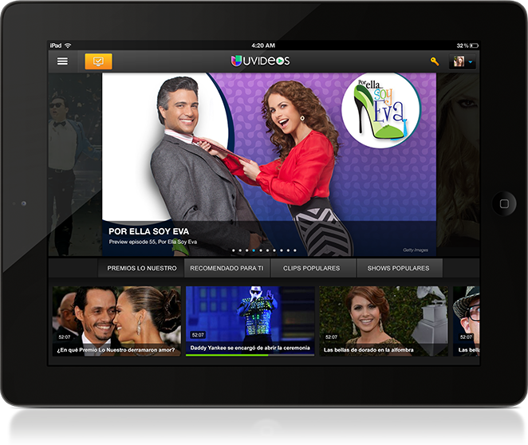
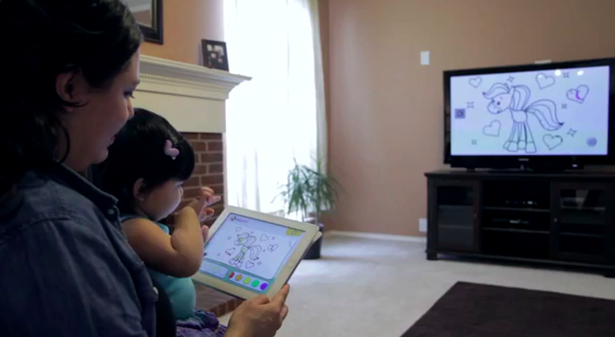

Second screen apps are like a sidecar on a motorcycle: a way to bring along your favorite pal while hitting the open road. App developers can take advantage of millennials' inability to put down their mobile devices by creating useful, interactive applications that complement rather than distract from the television. Here, for your viewing pleasure, are five of our favorite second screens apps. Watch <em>and</em> learn (see what we did there?).<!--more-->
<h2>1. TVTag</h2>
<h2></h2>
TVTag is the must-have TV-junkie second screen app for the connected tube watcher with a wandering mind. <a href="http://tvtag.com">TVTag</a> integrates with social media so users can share their responses to what's happening in real time, often creating trending topics on Twitter and other networks. Available for smartphones and tablets, this app is the heir to the GetGlue legacy of complete TV-watching connectivity.
<h2>2. Assassin's Creed 4: Black Flag Companion</h2>
<h2></h2>
The second screen revolution in gaming offers game developers an opportunity to up the ante in cross-platform gaming. While there are a number of games with some type of second screen app available, we like <a href="https://itunes.apple.com/us/app/assassins-creed-iv-black-flag/id692766233?mt=8">Assassin's Creed 4: Black Flag's companion app</a>, available in the iTunes store, for its bonus maps aiding in-game navigation for a truly immersive gaming experience. If you haven't tried out a cross-platform gaming event, have a look at this app and others and see how developers are betting on second screen gaming as an exciting enhanced experience.
<h2>3. AMC's Story Sync App</h2>
<h2></h2>
Fans of popular AMC series <em>The Walking Dead, Breaking Bad, </em>and <em>The Killing</em> have a VIP ticket to behind-the-scenes info and social sharing with <a href="http://www.amctv.com/shows/the-walking-dead/story-sync">AMC's Story Sync second screen app</a>. AMC was wise to jump on the second screen bandwagon early, releasing the initial version of Story Sync in 2012 in conjunction with the second season of the wildly popular zombie drama <em>The Walking Dead.</em> This app caters most directly to the intensely loyal fans of AMC's most popular series, but even the casual viewer can benefit from real time updates of engaging polls, insider info on specific storylines and characters, and a good social media linkup through which fans can converse about (and cross-promote) all of AMC's series.
<h2>4. Applicaster CrossMates</h2>

Perhaps no other network has invested more in social media reach than <a href="http://www.univision.com">Univision</a>, a leading media corporation aimed at the Hispanic American market. Now Univision has partnered with an Israeli social TV firm called Applicaster to offer CrossMates, a rich second screen experience for the serious serial viewer. The principal difference between this second screen experience and that of other network/tech collaborations is the <a href="http://www.businesswire.com/news/home/20140205005775/en/Applicaster-Partners-Univision-Bring-Viewers-TV-Characters#.U9EIFl4YJ9c">CrossMates/Univision partnership</a> that begins during or even <em>before </em>production of some of Univision's top programs, especially the wildly popular <em>telenovelas</em>. Second screen elements are included in the scripts themselves so that the overall experience is enriched for tech-savvy viewers. Users benefit from "asymmetric storytelling," allowing fans to tailor their viewing experience to the television hero or heroine of their preferences. The personalized experience offered by this partnership makes it our top pick for fully realized second screen viewing of television series.
<h2>5. AT&amp;T U-Verse BabyFirst App</h2>

While some parents question the wisdom of exposing young children to nonstop media from a very early age, the makers of the <a href="http://about.att.com/story/babyfirst_interactive_child_uverse_tv_app.html">AT&amp;T U-Verse "BabyFirst" app</a> are counting on tech-addicted parents of the youngest viewers to use the second screen app to create a more interactive television viewing experience. The app, included in AT&amp;T U-Verse broadcast service, pairs with the BabyFirst channel on the U-Verse lineup to let parents and children create pictures and collages on the iPad or other tablet that are then viewable on the television screen. The app's developers included the insights of child development experts when designing the platform, which they claim will help develop crucial skills such as hand-eye coordination. The free app is available for non-U-Verse subscribers as well, but in this iteration it only operates as a standalone app without second screen functionality.

It's clear that second screen is the enhanced viewing wave of the future. What are your favorite second screen applications? Share them with us in the comments.