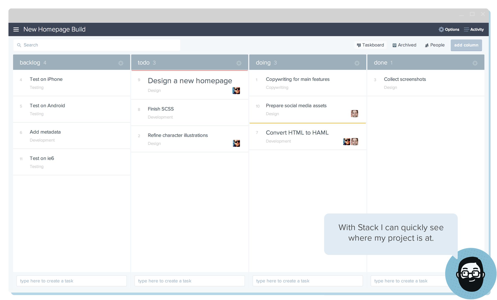
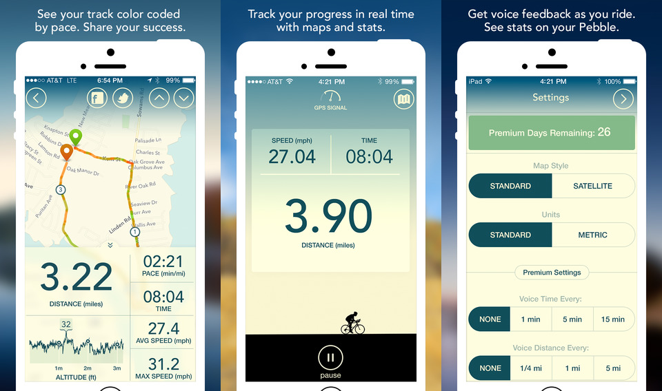
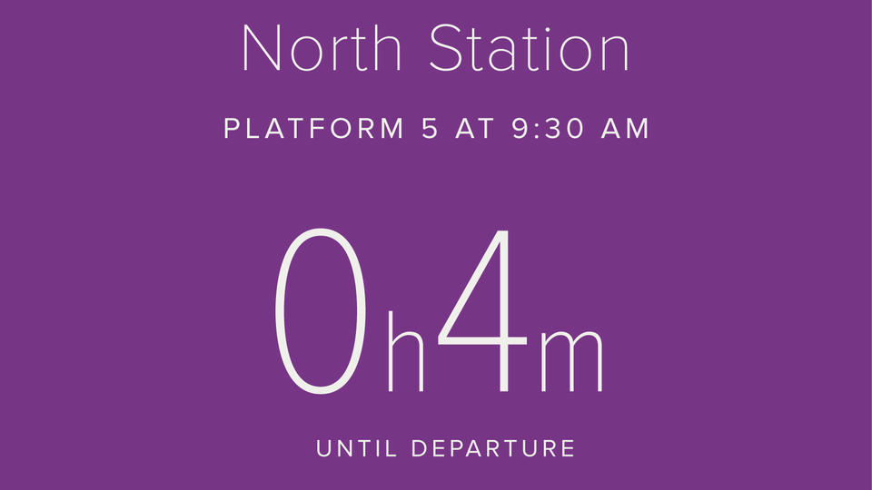
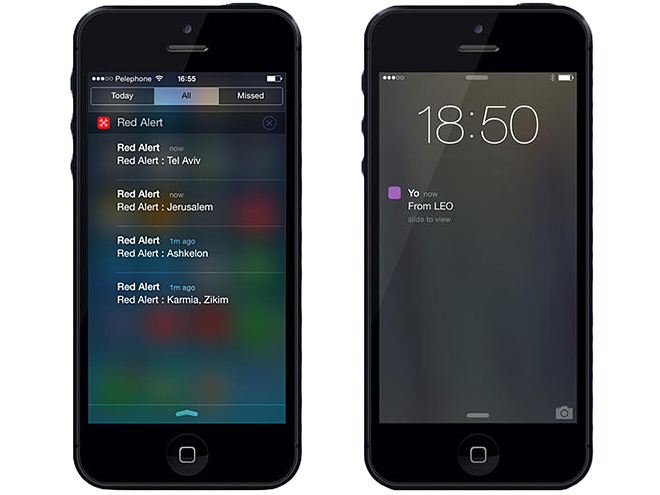
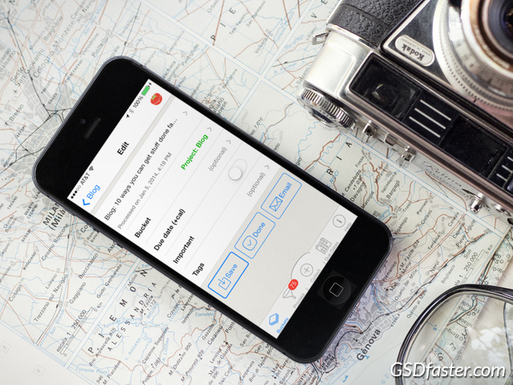

Every month, we see some incredible real-time apps launch in the app store. Here are some that caught our eye this past July.

## **1\. Stack**

 [Stack](http://www.getstack.io) is a productivity tool that brings your team, tasks, discussions, and workflow together — so you can get more stuff done. The app lets you manage your projects seamlessly, letting you assign responsibility, set due dates and priorities, and attach files to your tasks. Additionally, Stack lets you comment on tasks in real-time so you and your team can stay in sync.

## **2\. Vima – GPS Bike Tracker**

 [Vima](https://itunes.apple.com/us/app/vima-gps-bike-tracker/id887991296?ls=1&mt=8) is a GPS based app that lets you keep track of your biking fitness goals.  Vima tracks your speed, distance, and time and displays a map so you know where you’re going. If you don’t want to check your phone every few minutes, Vima can give you audio updates on your route at set distance and time intervals. You can also view your saved routes, which are color-coded by pace on the map.

## **3\. The Official MBTA Commuter Rail App**

 This clean and simple [real-time app](http://www.keoliscs.com/mbta-commuter-rail-app/) takes commuting to a new level in the Massachusetts Bay area. The app alerts you to possible delays, lets you know how much time you have until your train arrives, and then follows your train’s progress. If you’re inclined to naps on public transportation, the app also offers an alarm to wake you up before your stop. And, to help you keep track of your carbon footprint, you can check how much gas you’ve saved by riding the train.

## **4\. Red Alert: Israel**

 This [app](http://www.timesofisrael.com/red-alert-app-offers-a-yo-update-on-missile-attacks/) is is used in conjunction with the "Yo" push notification system to warn Israelis who cannot hear the “Red Color” emergency siren for rocket explosions. It provides real-time alerts directly from military sources every time a rocket, mortar, or missile is fired, and has been dubbed by [some](http://www.wired.com/2014/07/an-actually-useful-version-of-yo-is-warning-israelis-of-rocket-strikes/) as an_ "actually useful_ version of Yo." Because users can click on alerts to leave comments, the app has turned into a kind of social network and public relations tool.

## **5\. GSDfaster**

 [GSDfaster](http://www.gsdfaster.com) is a ToDo list and timer app that follows the [Getting Things Done](http://gettingthingsdone.com/about/) (GTD) method. The app’s timer breaks tasks into 25-minute intervals with short breaks for maximum productivity. With GSDfaster you can sync GSD stuff to your calendar. The app has iCloud integration across multiple devices and works well with Gmail.
