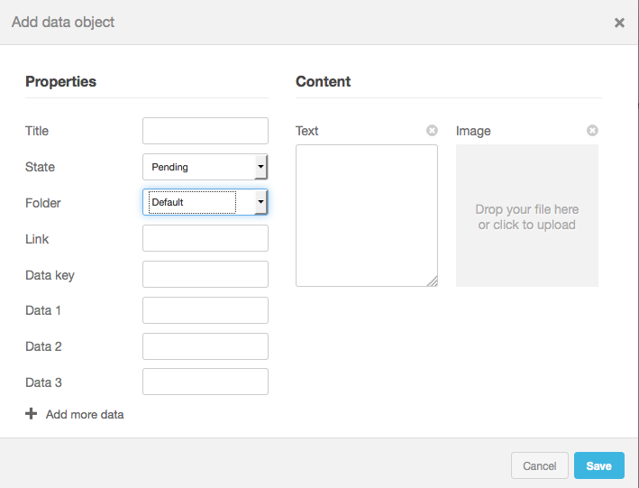
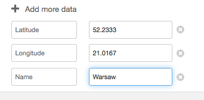
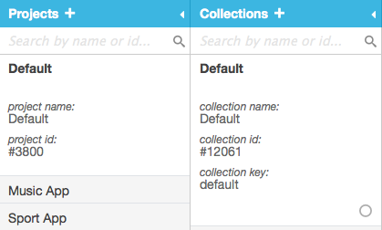
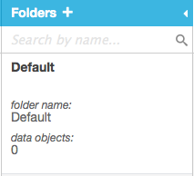
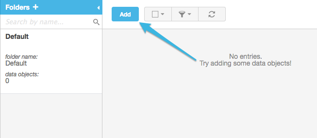
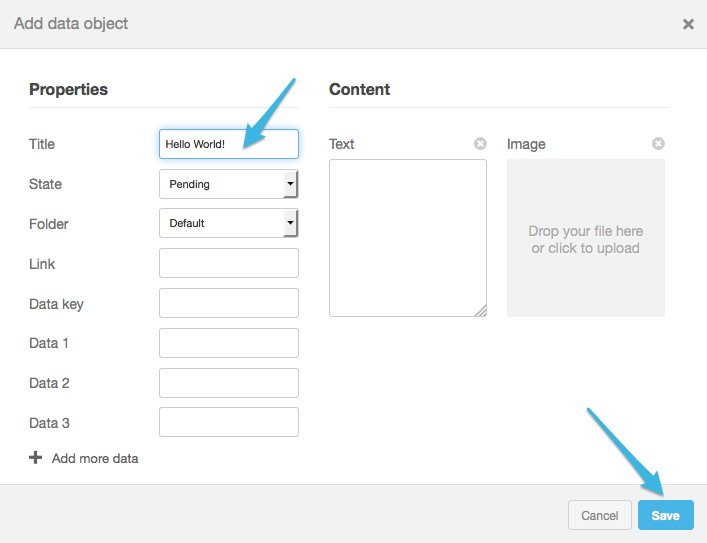

Within minutes, you can create dynamic iOS apps on Syncano that instantly reflect changes in data by “subscribing” to changes on Syncano’s Sync Server. Here’s a demo app and a quick guide so you can get started.

<h2>Introduction to Syncano</h2>
Syncano offers many <a href="http://www.syncano.io/features/">features</a> such as data modeling, an Admin GUI, a real-time sync API, data storage, and more. In this example, we'll focus on the latter two features - storing and syncing data.

<h2>Data Storage</h2>
To store data we use <em>DataObjects</em>, which are basically containers for a set of properties. We've already created a set of keys like <em>Title</em>, <em>Text</em>, or <em>Link</em> for each Data Object, which can store text values.

Each object can be given a state (<em>Pending</em>, <em>Moderated</em> or <em>Rejected</em>), something useful if you want to moderate incoming data before displaying it to your users e.g. inside an app or on a big screen.

You can also add an image to the object, and Syncano will automatically make a thumbnail of it for you. Whenever you download the object, you will receive urls to both the image and its thumbnail.

There are also special fields (<em>Data1</em>, <em>Data2</em> and <em>Data3</em>) which can hold integer values - you can filter and sort your data with these fields. You can also sort your data by its creation date and the date of its last update, and you can filter it by the folder it's in.



You can also add a number of additional fields if the default ones don't meet your needs. If you're adding data on the Admin GUI, press the <em>Add more data</em> button and additional fields will appear.



<h2>Real-time sync</h2>
Storing data is one thing, but you might also want to sync it across multiple apps and devices. Real-time communication on Syncano comes in two flavors (what we call notification/subscription processing):

- Notifications: sending messages (defined basically as a JSON) to other apps/devices listening without storing the messages themselves. Listeners are notified instantly about messages when they are received.
- Subscriptions: asking our server to deliver information to you in real-time whenever there is a change on the server side. This could be a new object that was added or an old one that was changed or deleted – our Sync Server will instantly notify you.

Syncano's Sync Server uses a <a href="http://stackoverflow.com/questions/5436069/what-are-the-differences-between-stateless-and-stateful-systems-and-how-do-they">stateful connection</a> and gives you the ability to make API requests inside a TCP connection.

<h2>Getting Started</h2>
Below are simple instructions on creating a real-time synced iOS app on Syncano. You can also download the full demo app <a href="https://github.com/lifcio/syncserver-ios-test">here</a>.

<H2>1. Install CocoaPods</h2>
Open <em>Terminal</em> and type:
```javascript
sudo gem install cocoapods
```

<h2>2. Add syncano's iOS Library through CocoaPods</h2>
In <em>Terminal</em>, navigate to the folder with the XCode project that you'd like to real-time sync, ie.
```javascript 
cd ~/syncano-sync-server-test/
```
where <em>~/syncano-sync-server-test/</em> is the actual path to the project.

Then, write in <em>Terminal</em>:
```javascript
ls
``` 
and make sure you see your <em>.xcodeproj</em> file.

Then, type: 
```javascript
pod init
```

When the command is finished, you should see a new file named <em>Podfile</em> in your project's folder. Open it in your favorite text editor and add following line under the target and end keywords:
```javascript
pod 'syncano-ios'
```

Your <em>Podfile</em> should now look more less like this: 
```javascript
target "My-Application-Name" do
    pod 'syncano-ios'
end
```

Close the <em>Podfile</em>, go back to <em>Terminal</em> and type:
```javascript
pod install
```

When the command is finished, make sure you open (and from now on only use) the newly created <em>.xcworkspace</em> file, NOT the <em>.xcodeproj</em> file.

<h2>3. Add Sync Server to your source code</h2>

For this example, we'll assume you will be adding the Syncano Sync Server file to an instance of UIViewController. If you want to add it somewhere else, use the below as a guide - you will be taking the same essential steps.

Include Syncano's header files by adding them at the top of your implementation (<em>.m</em>) file:
```javascript
#import <Syncano.h>
#import <SyncanoSyncServer.h>
```

In the interface of your class, add the following property:
```javascript
property (strong, nonatomic) SyncanoSyncServer *syncServer;
```

Initialize the <em>syncServer</em> property (you can add this line e.g. to your <em>viewDidLoad</em> method):
```javascript
self.syncServer = [SyncanoSyncServer syncanoSyncServerForDomain:@"PUT-YOUR-DOMAIN-HERE" apiKey:@"PUT-YOUR-API-KEY-HERE"];
```

Set yourself as a delegate of the Sync Server object after initializing it:
```javascript
self.syncServer.delegate = self;
```

Connect to Sync Server:
```javascript
NSError *error = nil;
[self.syncServer connect:&amp;error];
```

Subscribe to changes in your chosen collection (we recommend you add it to the implementation of the method mentioned below - <em>syncServerConnectionOpened:</em>):
```javascript
SyncanoParameters_Subscriptions_SubscribeCollection *params = [[SyncanoParameters_Subscriptions_SubscribeCollection alloc] initWithProjectId:@"3800" collectionId:@"12061" context:@"connection"];
[self.syncServer sendRequest:params callback:^(SyncanoResponse *response) {
NSLog(@"Subscription response: %@",response);
}];
```

Add information about implementing <em>SyncanoSyncServerDelegate</em>:
```javascript
@protocol SyncanoSyncServerDelegate;
@interface MyViewController : UIViewController <SyncanoSyncServerDelegate>
```

Implement <em>SyncanoSyncServerDelegate</em> required methods by adding this to your implementation file:

```javascript
- (void)syncServerConnectionOpened:(SyncanoSyncServer *)syncServer {
  NSLog(@"Sync Server Connection opened");
  SyncanoParameters_Subscriptions_SubscribeCollection *params = [[SyncanoParameters_Subscriptions_SubscribeCollection alloc] initWithProjectId:@"3800" collectionId:@"12061" context:@"connection"];
  [self.syncServer sendRequest:params callback:^(SyncanoResponse *response) {
    NSLog(@"Subscription response: %@",response);
  }];
}

- (void)syncServer:(SyncanoSyncServer *)syncServer connectionClosedWithError:(NSError *)error {
  NSLog(@"Sync Server Error: %@", error);
}
```

Add desired optional protocol methods to receive notification and subscription information.
E.g. to receive messages about new objects being added to Syncano, implement following method:
```javascript
- (void)syncServer:(SyncanoSyncServer *)syncServer notificationAdded:(SyncanoData *)addedData {
NSLog(@"Added data: %@",addedData);
}
```

That's it. From now on, you'll be able to receive information every time a new object is created.

<h2>Add the GUI</h2>
To show new objects on the screen, you can add a label that will contain the title of the last created object.

Add the label property to your class in its interface:
```javascript
@property (strong, nonatomic) UILabel *label;
```

Initialize the label and add it to your view in the <em>viewDidLoad</em> method:
```javascript
self.label = [[UILabel alloc] initWithFrame:CGRectMake(0, 50, CGRectGetWidth(self.view.bounds), 50)];
self.label.textAlignment = NSTextAlignmentCenter;
[self.view addSubview:self.label]; 
```

Add the following lines to the <em>syncServer:notificationAdded</em> method (because protocol methods are invoked on an internal thread, you'll have to make sure you dispatch any UI code to the main thread):
```javascript
- (void)syncServer:(SyncanoSyncServer *)syncServer notificationAdded:(SyncanoData *)addedData {
NSLog(@"Added data: %@", addedData);
dispatch_async(dispatch_get_main_queue(), ^{
self.label.text = addedData.title;
});
}
```

You'll now see title of the last added object on your device screen changing in real-time.

<h2>Testing the app</h2>
Open the <a href="http://login.syncano.com">Syncano admin GUI</a> in your browser window, and launch the app on your computer. in your browser window and launch the app on your computer using either the iOS Simulator or your iOS device (make sure both are connected to the Internet).

Choose the project and collection you entered in XCode.



Within the collection, choose the folder you want to add Data Objects to. Since we subscribed to changes in the whole collection, it doesn't matter which folder we will choose - we'll receive notifications either way.



Within the project and collection you entered in Xcode, add a new Data Object.



In the Title field, type “Hello world!” and hit <em>Save</em>.



The title of the new object should now instantly show in your app.

<H2>Monitoring your App</H2>
Now that you've created a successful real-time application, how do you monitor it's performance? For the answer, check out our next tutorial in this series, <a href="http://www.syncano.io/blog/monitor-app-performance-crittercism/">"How to Monitor Your App's Performance."</a>