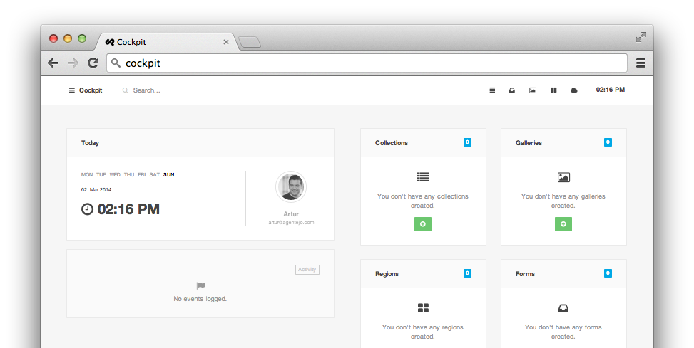
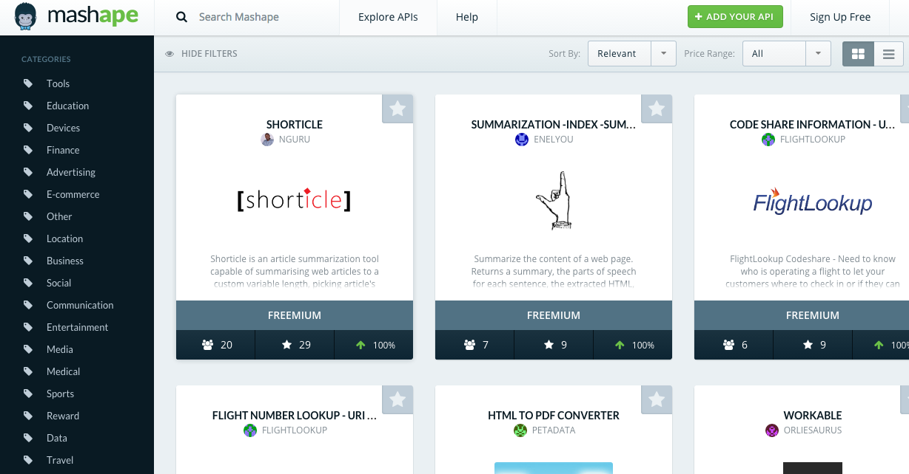
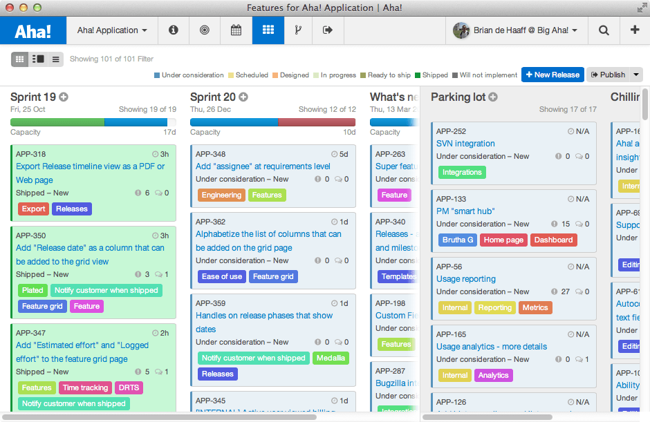
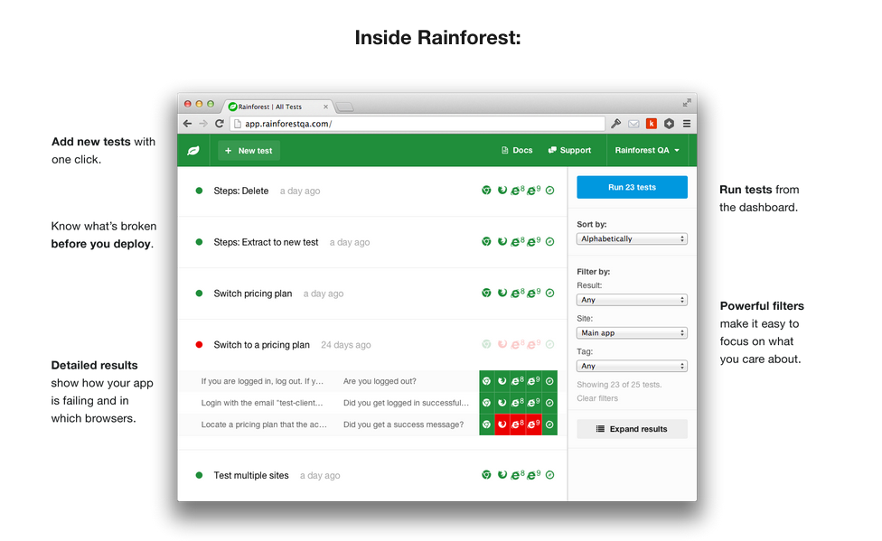
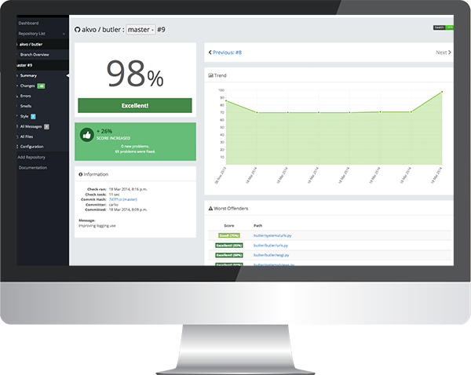

As developers, we have more tools than ever to automate and assist with every step of our projects—the hard part is figuring out which tools are worth using in our apps. Here’s a glance at 5 tools that we've tried and recommend to simplify your workflow.<!--more-->
<h2><strong>Cockpit: Cloud CMS</strong></h2>

Cockpit is the CMS for developers. It's an API-driven, open-source CMS that's lightweight and modular – giving you more control than other platforms.
<h2><strong>Mashape: API Marketplace</strong></h2>

Mashape is both the "Github" and "Etsy" of APIs. It's a marketplace for discovering and connecting with all sorts of user-created APIs. You can also add your own API and track its usage or add a billing layer to generate revenue from it.
<h2><strong>Aha!: Roadmapping Software</strong></h2>

Aha! is cloud-based software that helps you collaborate on agile product development. It integrates with tons of apps including Jira, puts every task onto a visual roadmap, and allows you to publish anything to the web that you might want to share with the non-technical people on your team.
<h2><strong>Rainforest QA: Browser Testing</strong></h2>

Rainforest is a service that will test your URL on every browser you ask for and send a bug report within 30 minutes. When you have lots of other things to focus on, quick feedback on browser bugs is a welcome relief.
<h2><strong>Landscape: Code Quality Metrics</strong></h2>

Like a Fitbit for your Python code, Landscape provides feedback for code quality. It helps streamline and simplify deployment by checking for coding errors, providing metrics as soon as you sign up, and spotting recurring errors to improve your code.

&nbsp;

With tools like these, it's easier and faster than ever to build applications. That’s the power of Syncano: simplifying your backend and giving you the tools you need to focus on other complex and critical components of your app.