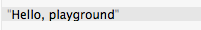
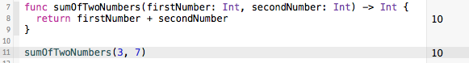
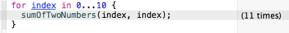
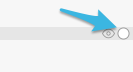
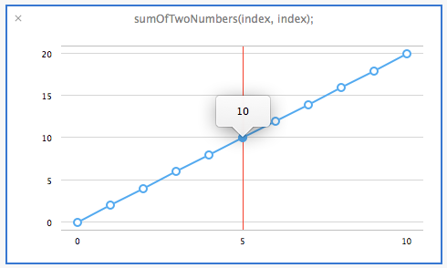
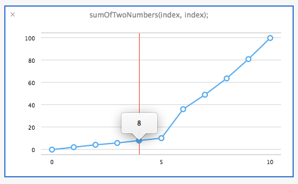
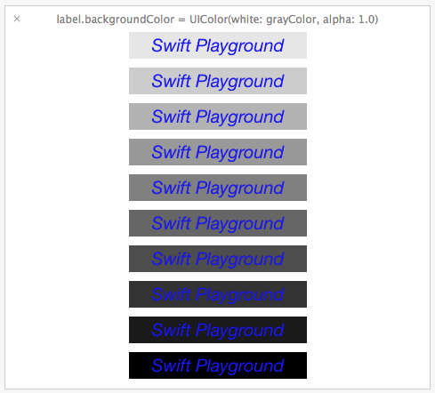
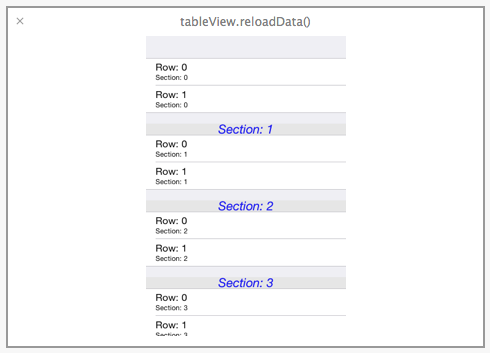
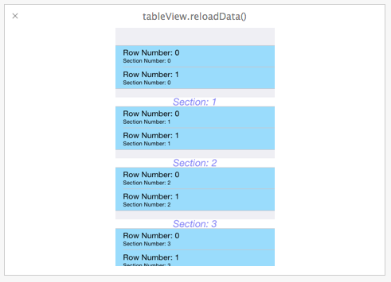

As Apple announced during their latest event, you can now write <a href="https://developer.apple.com/swift/">Swift</a> applications and submit them to the AppStore.

One of the most interesting features of Swift and the new XCode IDE are its interactive playgrounds. In the playgrounds, you can type a line of code and the result appears immediately – enabling you to run your code after you make changes without creating new projects. You can finally stop flinching in pain when you're designer tells you a button needs to be just a few pixels farther to the left.

## XCode<

Before you start working in a playground, make sure you've downloaded version 6 of XCode (available on the <a href="https://itunes.apple.com/us/app/xcode/id497799835">AppStore</a>).

Once you have it installed (it may take some time), don't start a  new project. Instead, hit _File -> New -> Playground_.

When you create a new playground file, it will be filled with this content by default:

```javascript
// Playground - noun: a place where people can play

import UIKit

var str = "Hello, playground"
```

The code will fill whole left side of the file, and on the right you can see its corresponding results:



## Adding a function

Let's add a function to the playground to see if it works properly. Start by calculating the sum of 3 + 7:

```javascript
func sumOfTwoNumbers(firstNumber: Int, secondNumber: Int) -> Int {
&nbpsp; return firstNumber + secondNumber
}

sumOfTwoNumbers(3, 7)
```



As you can see on the right, the result is 10 – meaning the playground is working as expected.

## Timeline

If the code you write works over time and its result changes, you can enable the timeline view to see what's happening under the hood.

Here's an example of how this works. Add a loop to your code by entering:

```javascript
for index in 0...10 {
  sumOfTwoNumbers(index, index);
}
```



Notice how the result indicates the code ran 11 times - as it actually did. Next to that result, there is an eye icon and a circle icon.



Click on the circle icon to see the _Value History_: a chart that shows how your values changed overtime.

There are 11 discreet points on this graph. Click on one to see it's value. For example, when you click on the sum of 5 and 5, you'll get it's sum: 10.



_This graph also helps with more advanced calculations, because you can quickly see if something is wrong (e.g. when larger or negative numbers are taken as inputs)._

_Notice what happens if we change our code to multiply both numbers when the first number is greater than 5:_

```javascript
func sumOfTwoNumbers(firstNumber: Int, secondNumber: Int) -> Int {
 &npsp; if (firstNumber > 5) {
 &npsp; &npsp; return firstNumber * secondNumber
&npsp; }
 &npsp; return firstNumber + secondNumber
}
```

the chart would now look like this:



## Testing UI and the Quick Look Feature

You can also use UI code in Playground - a pretty neat feature. Start here by creating and configuring a simple UILabel.

```javascript
let label = UILabel(frame: CGRect(x: 0, y: 0, width: 200, height: 30))
label.textAlignment = NSTextAlignment.Center
label.font = UIFont.italicSystemFontOfSize(20)
label.textColor = UIColor.blueColor()
label.text = "Swift Playground"
```

Now, click the _Quick Look_ icon (the eye icon) next to the last line of your code to see how the label looks.


You can also see how the label would look with varying gray backgrounds.  Add this loop to change it to different UIColor instances:

```javascript
for var grayColor : CGFloat = 0.9; grayColor > 0.0; grayColor -= 0.1 {
&nbsp; label.backgroundColor = UIColor(white: grayColor, alpha: 1.0)
}
```

To see the history of how the background changed, click the _Value History_ icon (plus sign icon), next to the line where we set the background color.



## More advanced UI testing - UITableView

So what about more complicated UI things like UITableView? That also requires a data source and a delegate – and those need to be instances of existing classes, right? Fortunately, it is all possible to do in the playground.

You can start by creating a class conforming to a UITableViewDelegate protocol. Inside will be two functions - one defining the height of a single row, and another returning the custom header view.

As a requirement, your class must also conform to NSObjectProtocol. You'll do that by subclassing _NSObject_.

To create a custom header view, use the same code you used to create a label with one of the background colors we used earlier:

```javascript
class Delegate : NSObject, UITableViewDelegate {
&nbsp; func tableView(tableView: UITableView, heightForRowAtIndexPath indexPath: NSIndexPath) -> CGFloat {
&nbsp; &nbsp; return 44
&nbsp; }

&nbsp; func tableView(tableView: UITableView, viewForHeaderInSection section: Int) -> UIView? {
&nbsp; &nbsp;  let label = UILabel(frame: CGRect(x: 0, y: 0, width: tableView.bounds.width, height: 50))
&nbsp; &nbsp; label.textAlignment = NSTextAlignment.Center
&nbsp; &nbsp; label.font = UIFont.italicSystemFontOfSize(20)
&nbsp; &nbsp; label.backgroundColor = UIColor(white: 0.2, alpha: 1.0)
&nbsp; &nbsp; label.textColor = UIColor.blueColor()
&nbsp; &nbsp; label.text = "Section: \(section)"
&nbsp; &nbsp; return label
&nbsp; }
}
```

<hr />

### NOTE

Remember this is just sample code to quickly implement a table view. In your project, try to register Nib for the header whenever possible and reuse it later with the function _dequeueReusableHeaderFooterViewWithIdentifier(identifier:)_. For simplicity, you're recreating a new UILabel here, but doing so in your own app can affect its performance.

<hr />

Next, add a DataSource class. Implement obligatory functions returning the number of rows in a section, a cell for index path, and as an extra - the number of sections in a table view to see how creating the header view in Delegate works:

```javascript
class DataSource : NSObject, UITableViewDataSource {
&nbsp; func tableView(tableView: UITableView, numberOfRowsInSection section: Int) -> Int {
&nbsp; &nbsp; return 2
&nbsp; }

&nbsp; func numberOfSectionsInTableView(tableView: UITableView) -> Int {
&nbsp; &nbsp; return 4
&nbsp; }

&nbsp; func tableView(tableView: UITableView, cellForRowAtIndexPath indexPath: NSIndexPath) -> UITableViewCell {
&nbsp; &nbsp; var identifier = "Identifier"
&nbsp; &nbsp; var cell : UITableViewCell? = nil
&nbsp; &nbsp; cell = tableView.dequeueReusableCellWithIdentifier(identifier) as UITableViewCell?
&nbsp; &nbsp; if (cell == nil) {
&nbsp; &nbsp; &nbsp; cell = UITableViewCell(style: UITableViewCellStyle.Subtitle, reuseIdentifier: identifier)
&nbsp; &nbsp; }
&nbsp; &nbsp; cell?.textLabel?.text = "Row: \(indexPath.row)"
&nbsp; &nbsp; cell?.detailTextLabel?.text = "Section: \(indexPath.section)"
&nbsp; &nbsp; return cell!
&nbsp; }
}
```

Now you need to create Delegate and DataSource objects and set them as properties of our newly created UITableView. At the end, you have to perform a _reloadData()_ function for the tableView to fetch data from your data source.

```javascript
let delegate = Delegate()
let dataSource = DataSource()
let tableView = UITableView(frame: CGRect(x: 0, y: 0, width: 320, height: 480), style: UITableViewStyle.Grouped)
tableView.delegate = delegate
tableView.dataSource = dataSource
tableView.reloadData()
```

Now on the last line (the one with _reloadData()_), you can use either _Quick Look_ or _Value History_ to see how your tableView looks. For this example, click on the latter to see how it changes while we change the code.



Now add some more info to your cells and change its background color as well as your header view look.

In the Delegate class, change the function creating header view to:

```javascript
func tableView(tableView: UITableView, viewForHeaderInSection section: Int) -> UIView? {
&nbsp; &nbsp; let label = UILabel(frame: CGRect(x: 0, y: 0, width: tableView.bounds.width, height: 50))
&nbsp; &nbsp; label.textAlignment = NSTextAlignment.Center
&nbsp; &nbsp; label.font = UIFont.italicSystemFontOfSize(20)
&nbsp; &nbsp; label.backgroundColor = UIColor.whiteColor()
&nbsp; &nbsp; label.textColor = UIColor(red: 0.5, green: 0.5, blue: 1.0, alpha: 1.0)
&nbsp; &nbsp; label.text = "Section: \(section)"
&nbsp; &nbsp; return label
&nbsp; }
```

And then update the function creating a cell in the Data Source:

```javascript
func tableView(tableView: UITableView, cellForRowAtIndexPath indexPath: NSIndexPath) -> UITableViewCell {
&nbsp; &nbsp; var identifier = "Identifier"
&nbsp; &nbsp; var cell : UITableViewCell? = nil
&nbsp; &nbsp; cell = tableView.dequeueReusableCellWithIdentifier(identifier) as UITableViewCell?
&nbsp; &nbsp; if (cell == nil) {
&nbsp; &nbsp; &nbsp; cell = UITableViewCell(style: UITableViewCellStyle.Subtitle, reuseIdentifier: identifier)
&nbsp; &nbsp; &nbsp; cell?.backgroundColor = UIColor(red: 0.62, green: 0.86, blue: 1.0, alpha: 1.0)
&nbsp; &nbsp; }
&nbsp; &nbsp; cell?.textLabel?.text = "Row Number: \(indexPath.row)"
&nbsp; &nbsp; cell?.detailTextLabel?.text = "Section Number: \(indexPath.section)"
&nbsp; &nbsp; return cell!
&nbsp; }
```

After a short while, Timeline will refresh, and your Table View will change:



## Final words

Swift's playground can be a very useful tool, especially since you can quickly test UI element designs without creating a new project or worrying about rebuild time. Swift developers will probably begin implementing apps after testing ideas in the playground first, and then they'll continue to use the playground during the development process to quickly test small changes.

If you want to learn more about Swift, check out "The Swift Programming Language" – available in <a href="https://itunes.apple.com/us/book/swift-programming-language/id881256329?mt=11">iTunes</a>. You can also leave questions or additional comments below or email us at support@syncano.com - we'd be happy to help you get started!
