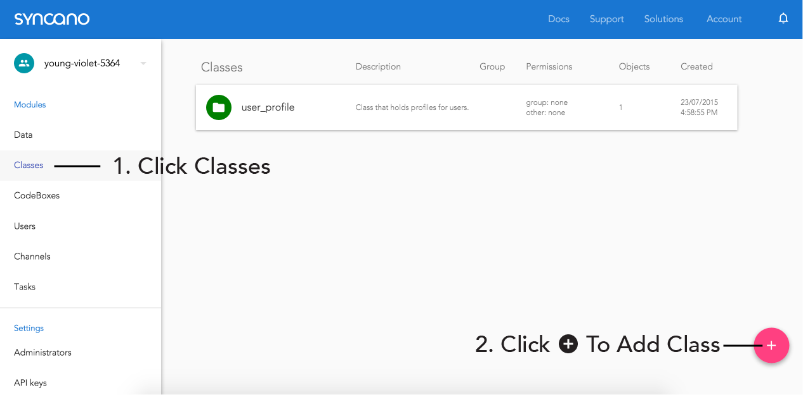
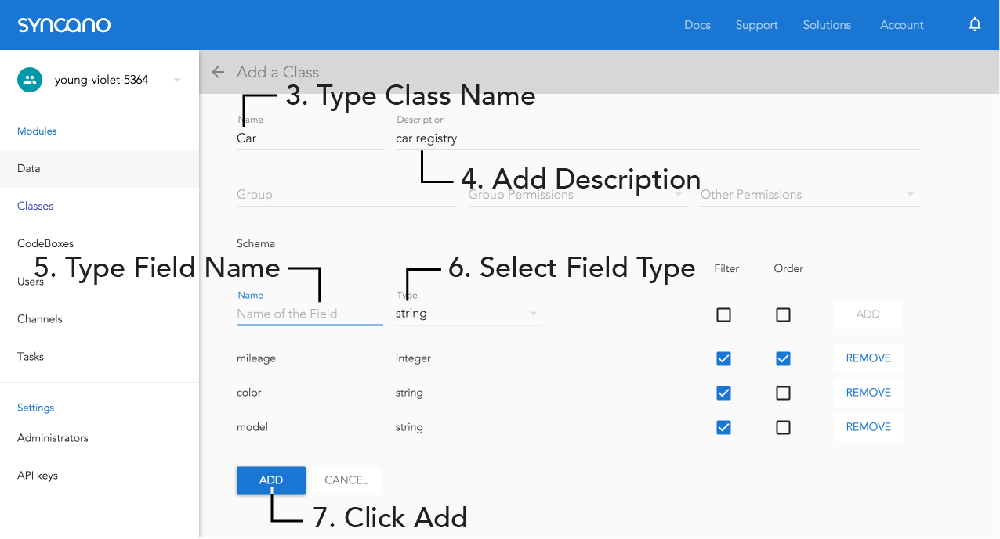
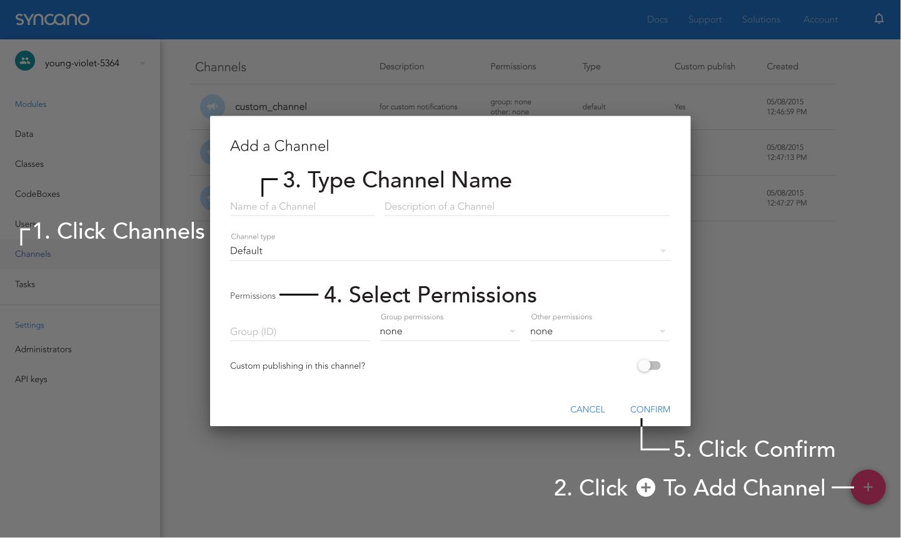
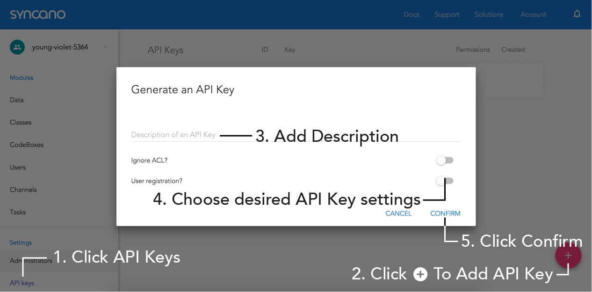
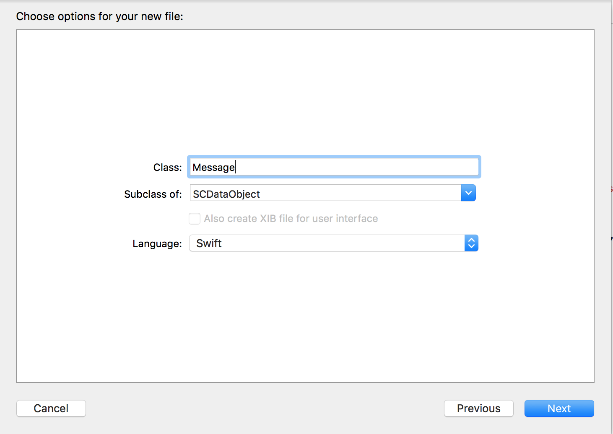

In this tutorial, your will learn how to create a simple chat app in iOS (using Swift and Syncano). 

In part 1, we covered only creating a new project and adding `JSQMessagesViewController` to it. 

In part 2 we will add storing data on the server and real-time updates (receiving new messages as soon as they are send by others, without a need to refresh).

If you missed part 1, you can find it [here](/blog/create-ios-chat-app-part1/). You can either start from the beginning with part 1, or just [grab a code](https://github.com/lifcio/SyncanoChat/tree/v4_Part_01) for it and start from here.

As a reminder - we do use [CocoaPods](http://cocoapods.org/about) in the app, so if you don't use it yet and don't know how to install it - go back to instructions posted in [part 1](/blog/create-ios-chat-app-part1/).

## 1. Add Syncano

Now - the exciting part - actually sending messages to our backend and receiving messages sent by others!

### 1.1 Sign Up

If you don't have an account yet, please sign up [here](https://dashboard.syncano.io/#/signup) - it takes only 10 seconds, and requires only your email and password.

### 1.2 Configure Syncano

Login to your Syncano account [here](https://dashboard.syncano.io/#/login). 

If you don't have a Syncano Instance yet (think of it as a project) or would like to use an empty one, you will have to add a new Instance first:


Note down your instance name and select it.

Now, we have to add a Class where we will hold all messages:



Type `Message` into a Class name and add following fields:

* text : String
* senderid : String
* attachment : File



We will also need a channel, which we'll use for the real-time sync.

Navigate into Channels and add a new one. Name it `Messages` and set `other permissions` to `publish`.



Finally, we create an API Key we will use to connect to your data. You can use any description you want, make sure you set `Ignore ACL` setting to True (so the switch is on the right side):



When key is added, write it down - we will need it later in the app.

### 1.3 Add Syncano to Chat App

First, we need Syncano object, to define Instance and API Key used for all the connections, and a Channel object, for the real-time sync. Add them at the beginning of your `ViewController` implementation:

```objc
let syncanoChannelName = "message"

class ViewController: JSQMessagesViewController {
    
    let syncano = Syncano.sharedInstanceWithApiKey(YOUR_API_KEY, instanceName: YOUR_INSTANCE_NAME)
    let channel = SCChannel(name: syncanoChannelName)
    
    //...
}
``` 
Replace `YOUR_API_KEY` and `YOUR_INSTANCE_NAME` with values you wrote down in step 1.2. If you named the channel differently than we suggested, replace the name as well.

### 1.4 Downloading and sending messages

Before we can start communicating with Syncano, we need to define a class that will correspond to the class created in Dashboard.

To do that, in XCode select:

`File -> New -> File` 

from the top menu (or press ⌘N).

Choose `Cocoa Class` and click `Next`. As a class name type `Message`, make sure the `Subclass of` is set to `SCDataObject`, language is `Swift` and click `Next`:



Replace content of newly added file `Message.swift` with:

```objc
import UIKit
import syncano_ios

class Message: SCDataObject {
    var text = ""
    var senderId = ""
    var attachment : SCFile?
    
    override class func extendedPropertiesMapping() -> [NSObject: AnyObject] {
        return [
            "senderId":"senderid"
        ]
    }
}
```
We defined inside the class properties matching the ones we added using the Dashboard. One exception is the `senderId` which is spelled using camelCase. Because all names on Syncano are stored with lowercase spelling, we want to tell Syncano that we will name this property differently (this way our variables names can still stick to iOS convention).

Go back to `ViewController.swift` file

Add another class extension at the bottom:

```objc
//MARK - Syncano
extension ViewController {
    
    func sendMessageToSyncano(message: JSQMessage) {
        let messageToSend = Message()
        messageToSend.text = message.text
        messageToSend.senderId = self.senderId
        messageToSend.channel = syncanoChannelName
        messageToSend.other_permissions = .Full
        messageToSend.saveWithCompletionBlock { error in
            if (error != nil) {
                //Super cool error handling
            }
        }
    }
    
    func downloadNewestMessagesFromSyncano() {
        Message.please().giveMeDataObjectsWithCompletion { objects, error in
            if let messages = objects as? [Message]! {
                self.messages = self.jsqMessagesFromSyncanoMessages(messages)
                self.finishReceivingMessage()
            }
        }
    }
    
    func jsqMessageFromSyncanoMessage(message: Message) -> JSQMessage {
        let jsqMessage = JSQMessage(senderId: message.senderId, senderDisplayName: message.senderId, date: message.created_at, text: message.text)
        return jsqMessage
    }
    
    func jsqMessagesFromSyncanoMessages(messages: [Message]) -> [JSQMessage] {
        var jsqMessages : [JSQMessage] = []
        for message in messages {
            jsqMessages.append(self.jsqMessageFromSyncanoMessage(message))
        }
        return jsqMessages
    }
}
```
The functions we just added will help to communicate with Syncano.

* `sendMessageToSyncano(message: JSQMessage)` will take a `JSQMessage` object, convert it to Syncano object and will send it to Syncano. Notice, that next to setting senderId and text parameters, we also set `channel` - used for real-time sync, and `other permissions`, used to define who will have access to this object - in this case we set `Full` permissions for everyone
* `downloadNewestMessagesFromSyncano()` will download newest messages from Syncano and replace currently stored ones with the ones from the server
* `jsqMessageFromSyncanoMessage(message: Message)` and `jsqMessagesFromSyncanoMessages(messages: [Message])` are just helper functions that will convert messages betwen `Message` and `JSQMessage` types

We will change one more piece of code, to make sure we will be sending messages typed by user to Syncano. Add `sendMessageToSyncano` function to `didPressSendButton`:

```objc
    override func didPressSendButton(button: UIButton!, withMessageText text: String!, senderId: String!, senderDisplayName: String!, date: NSDate!) {
        let message = JSQMessage(senderId: senderId, senderDisplayName: senderDisplayName, date: date, text: text)
        self.messages += [message]
        self.sendMessageToSyncano(message)
        self.finishSendingMessage()
    }
```

Now, instead of showing test messages, let's show actual messages coming from Syncano. We'll do this by downloading the latest messages when the app start in the viewDidLoad function. Notice we removed the code from before was adding test messages:

```objc
    override func viewDidLoad() {
        super.viewDidLoad()
        // Do any additional setup after loading the view, typically from a nib.
        self.setup()
        self.downloadNewestMessagesFromSyncano()
    }
```

When you run app, you will most probably see an empty screen. That's fine - we have no messages on the server yet. Send a few and restart the app - you will see that they were saved on the server. You can also go into your Dashboard on Syncano and see that messages were stored inside the `Message` Class.

### 1.5 Real-time!

The only thing missing in our app now, is the real-time piece and receiving new messages as soon as they are received by the server.

We could handle being notified about them by refreshing messages in the background every couple of seconds, but we are going to do it in a much smarter way - using Syncano Channels.

Start from enabling getting messages from the Channel we set up in the `setup()` message:

```objc
    func setup() {
        self.senderId = UIDevice.currentDevice().identifierForVendor?.UUIDString
        self.senderDisplayName = UIDevice.currentDevice().identifierForVendor?.UUIDString
        self.channel.delegate = self
        self.channel.subscribeToChannel()
    }
```

As we set ourselves as the delegate, we need to implement `SCChannelDelegate` protocol. We will do it by adding one last class extension at the bottom of `ViewController.swift` class:

```objc
//MARK - Channels
extension ViewController : SCChannelDelegate {
    
    func addMessageFromNotification(notification: SCChannelNotificationMessage) {
        let message = Message(fromDictionary: notification.payload)
        if message.senderId == self.senderId {
            //we don't need to add messages from ourselves
            return
        }
        self.messages.append(self.jsqMessageFromSyncanoMessage(message))
        self.finishReceivingMessage()
    }
    
    func updateMessageFromNotification(notification: SCChannelNotificationMessage) {
        
    }
    
    func deleteMessageFromNotification(notification: SCChannelNotificationMessage) {
        
    }
    
    func chanellDidReceivedNotificationMessage(notificationMessage: SCChannelNotificationMessage!) {
        switch(notificationMessage.action) {
        case .Create:
            self.addMessageFromNotification(notificationMessage)
        case .Delete:
            self.deleteMessageFromNotification(notificationMessage)
        case .Update:
            self.updateMessageFromNotification(notificationMessage)
        default:
            break
        }
    }
}
```

## Summary

That's it! You just finished part 2 of this tutorial and your app is semi-ready to be used. You can share it with your friends now, or wait for the part 3!

You can find the code on [GitHub](https://github.com/lifcio/SyncanoChat/tree/v4_Part_02).

In the third part, we will add user registration and authentication and a few UI tweaks, to visually distinguish between messages sent by different people. Stay tuned!

As always, if you have any troubles implementing the app, don't hesitate to leave a comment or ask for help at [support@syncano.com](support@syncano.com) (or shoot me a tweet at [@lifcio](https://twitter.com/lifcio)).
