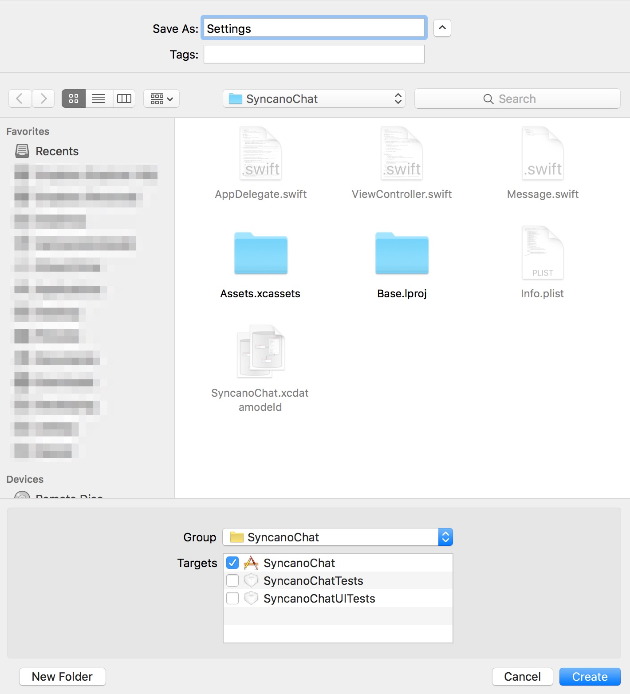
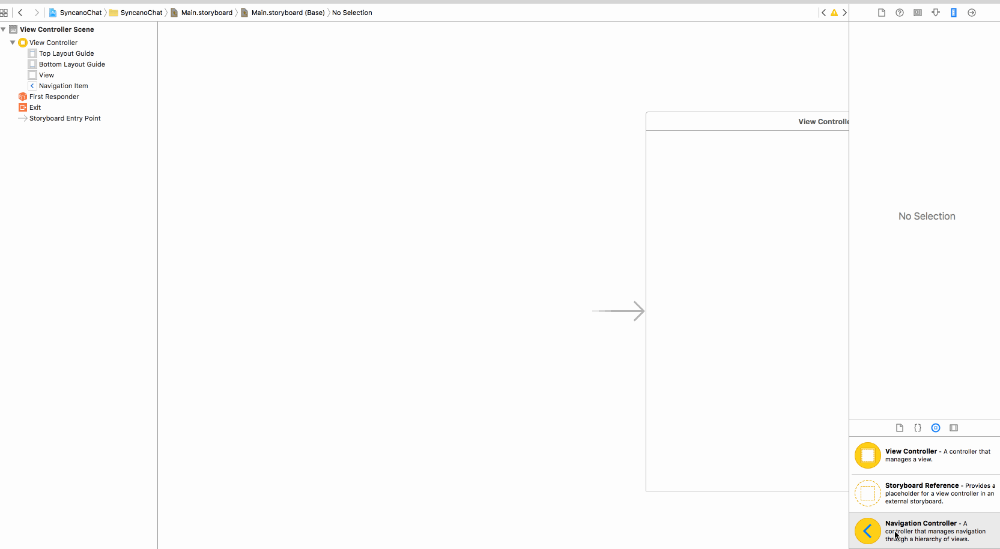
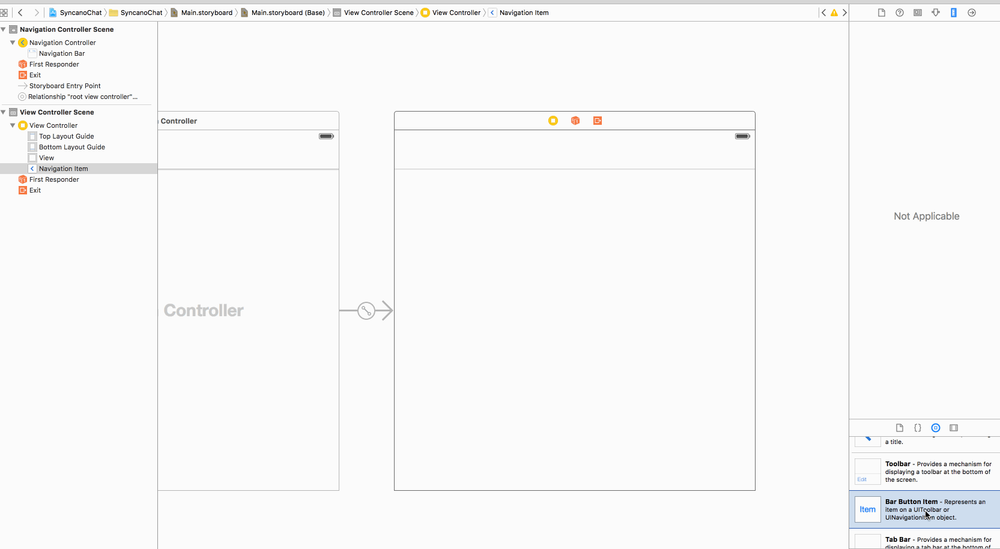
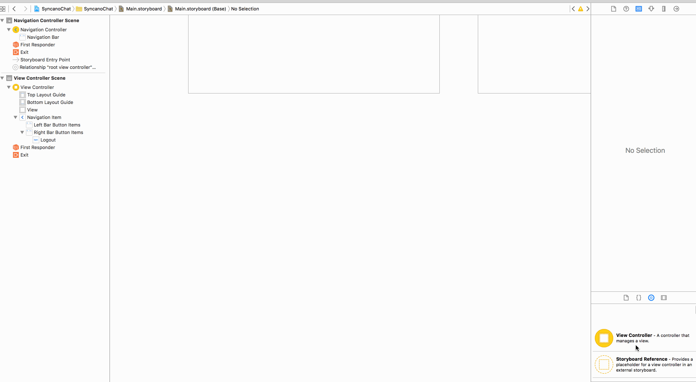
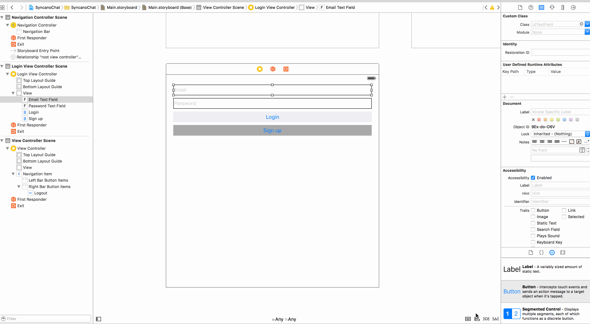

In this tutorial, your will learn how to create a simple chat app in iOS (using Swift and Syncano). 

In part 1 and 2, we covered creating a new project with `JSQMessagesViewController` used as a frontend and Syncano for the backend of the app. 

In part 3 we will add user auth - ability to sign up, log in and display sender name of each message.

If you missed previous parts, you can find them here:

* [Create an iOS Chat App using JSQMessagesViewController – Part 1](/blog/create-ios-chat-app-part1/)
* [Create an iOS Chat App using JSQMessagesViewController – Part 2](/blog/create-ios-chat-app-part2/) 

You can either start from the beginning with part 1, or just [grab a code from part 2](https://github.com/lifcio/SyncanoChat/tree/v4_Part_02) and start from here.

As a reminder - we do use [CocoaPods](http://cocoapods.org/about) in the app, so if you don't use it yet and don't know how to install it - go back to instructions posted in [part 1](/blog/create-ios-chat-app-part1/).

## 1. Add `IQKeyboardManagerSwift`

### 1.1 Add new CocoaPod

Let's start from adding a new CocoaPods - [`IQKeyboardManagerSwift`](https://github.com/hackiftekhar/IQKeyboardManager). Because we will be creating our own Login/SignUp screen - with text fields inside - and we don't want to focus on handling keyboard interactions in this tutorial, we will use a library that will do that for us.

Open Terminal app and navigate to your project, e.g. by typing:

```bash
cd ~/path/to/my/project/SyncanoChat
```

Edit Podfile by typing in Terminal:

```bash
open Podfile
```

Add one missing line with the new library:

```
pod 'JSQMessagesViewController'
```

After adding this line, your `Podfile` should look like this:

```
# Uncomment this line to define a global platform for your project
# platform :ios, '8.0'
# Uncomment this line if you're using Swift
use_frameworks!

target 'SyncanoChat' do
    pod 'syncano-ios'
    pod 'JSQMessagesViewController'
    pod 'IQKeyboardManagerSwift'
end

target 'SyncanoChatTests' do
    
end

target 'SyncanoChatUITests' do
    
end
```

Save the file, close the text editor and update project by typing into Terminal:

```bash
pod update
```

Once update is finished, open the Workspace file:

```bash
open SyncanoChat.xcworkspace
```

Build your project to make sure everything is installed correctly!

### 1.2 Enable `IQKeyboardManagerSwift`

Open `AppDelegate.swift` file and add two new imports - one for `IQKeyboardManagerSwift` and one for Syncano. Beginning of your file should contain these lines:

```objc
import UIKit
import CoreData
import syncano_ios
import IQKeyboardManagerSwift
```

In `application(application: UIApplication, didFinishLaunchingWithOptions launchOptions: [NSObject: AnyObject]?) -> Bool` function we will enable keyboard manager, and also instantiate Syncano shared instance:

```objc
func application(application: UIApplication, didFinishLaunchingWithOptions launchOptions: [NSObject: AnyObject]?) -> Bool {
        // Override point for customization after application launch.
        Syncano.sharedInstanceWithApiKey(syncanoApiKey, instanceName: syncanoInstanceName)
        IQKeyboardManager.sharedManager().enable = true
        IQKeyboardManager.sharedManager().shouldResignOnTouchOutside = true
        return true
    }
```

At this point, XCode should notify you about errors with `use of unresolved identifiers`. That's fine, we'll fix it in a second!

## 2. Add settings file

To simplify development, we will add a new file, where we will store credentials for Syncano.

To do that, select:

`File -> New -> File` 

from the top menu (or press ⌘N).

Select `Swift File`, click `Next`, call it `Settings` and save it in the project directory.



Open newly created file `Settings.swift`, remove its content and paste following lines:

```objc
let syncanoApiKey = ""
let syncanoInstanceName = ""
let syncanoChannelName = "message"
```

and enter your API Key and Instance name (you should have it in `ViewController.swift` file).

Go to `ViewController.swift` file, and remove 2 lines from there:

```objc
let syncanoChannelName = "message"
```
 
```objc
let syncano = Syncano.sharedInstanceWithApiKey("YOUR_API_KEY", instanceName: "YOUR_INSTANCE_NAME")
```

save the file, build and run your project to make sure it works as it did before.

## 3. Add `LoginViewController`

To handle login/sign up logic, we will need a new controller. Add a new `Swift File` (same way as before) and call it `LoginViewController`.

Open it, and replace contents of the file with:

```objc
import UIKit
import syncano_ios

let loginViewControllerIdentifier = "LoginViewController"

protocol LoginDelegate {
    func didSignUp()
    func didLogin()
}

class LoginViewController: UIViewController {
    @IBOutlet weak var emailTextField: UITextField!
    @IBOutlet weak var passwordTextField: UITextField!
    
    var delegate : LoginDelegate?
}

//MARK - UI
extension LoginViewController {
    @IBAction func loginPressed(sender: UIButton) {
        if self.areBothUsernameAndPasswordFilled() {
            self.login(self.getUsername()!, password: self.getPassword()!, finished: { error in
                if (error != nil) {
                    //handle error
                    print("Login, error: \(error)")
                } else {
                    self.cleanTextFields()
                    self.delegate?.didLogin()
                }
                
            })
        }
    }
    
    @IBAction func signUpPressed(sender: UIButton) {
        if self.areBothUsernameAndPasswordFilled() {
            self.signUp(self.getUsername()!, password: self.getPassword()!, finished: { error in
                if (error != nil) {
                    //handle error
                    print("Sign Up, error: \(error)")
                } else {
                    self.cleanTextFields()
                    self.delegate?.didSignUp()
                }
            })
        }
    }
    
    func getUsername() -> String? {
        return self.emailTextField.text
    }
    
    func getPassword() -> String? {
        return self.passwordTextField.text
    }
    
    func areBothUsernameAndPasswordFilled() -> Bool {
        if let username = self.emailTextField.text, password = self.passwordTextField.text {
            if (username.characters.count > 0 && password.characters.count > 0) {
                return true
            }
        }
        return false
    }
    
    func cleanTextFields() {
        self.emailTextField.text = nil
        self.passwordTextField.text = nil
    }
}

//MARK - Syncano
extension LoginViewController {
    func login(username: String, password: String, finished: (NSError!) -> ()) {
        SCUser.loginWithUsername(username, password: password) { error in
            finished(error)
        }
    }
    
    func signUp(username: String, password: String, finished: (NSError!) -> ()) {
        SCUser.registerWithUsername(username, password: password) { error in
            finished(error)
        }
    }
}
```

What does it actually do?

* `protocol LoginDelegate` - requires set of two method that must be implemented by the `delegate`. In our case, `delegate` will the `ViewController` and methods from the protocol will let our main controller know, that a user either logged in, or signed up for a new account,
* `@IBAction func loginPressed(sender: UIButton)` and `@IBAction func signUpPressed(sender: UIButton)` functions will be called on pressing buttons from the controller interface. Inside, they try to perform login and signup and on success they notify `delegate` about performed action,
* `getUsername() -> String?`, `getPassword() -> String?`, `areBothUsernameAndPasswordFilled() -> Bool` and `cleanTextFields()` are helper methods - they allow access to text fields content, clearing them and checking if both are non-empty,
* Syncano extension of `LoginViewController` contains two methods that use Syncano's `SCUser` object, to login or register user:

```objc
//MARK - Syncano
extension LoginViewController {
    func login(username: String, password: String, finished: (NSError!) -> ()) {
        SCUser.loginWithUsername(username, password: password) { error in
            finished(error)
        }
    }
    
    func signUp(username: String, password: String, finished: (NSError!) -> ()) {
        SCUser.registerWithUsername(username, password: password) { error in
            finished(error)
        }
    }
}
```

As you see, whole process is quite simple - it requires you to pass only username and password and returns an error if operation was unsuccessful (e.g. password was incorrect for login, or user already exists for signup)

## 4. Update `ViewController`

We're not far away from adding new features to out app. We have almost all pieces in place, we just need to connect them together.

### 4.1. `LoginViewController` additions

From withing `ViewController` we will decide whether to show Login screen or not - based on the fact if user is logged in or not. To do that, we first need to have access to the `LoginViewController`. Add one new property (e.g. under `var messages = [JSQMessage]()` add a line):

```objc
let loginViewController = UIStoryboard(name: "Main", bundle: nil).instantiateViewControllerWithIdentifier(loginViewControllerIdentifier) as! LoginViewController
```

Add `viewDidAppear` method under `viewDidLoad` - this function is being called when the view appears on the screens. We will check if user is already logged in, and if not - we will show login screen:

```objc
    override func viewDidAppear(animated: Bool) {
        super.viewDidAppear(animated)
        self.showLoginViewControllerIfNotLoggedIn()
    }
```

Because `self.showLoginViewControllerIfNotLoggedIn()` is not implemented yet, we need to add it. Add new class extension at the bottom of `ViewController.swift` file:

```
//MARK - Login Logic
extension ViewController : LoginDelegate {
    func didSignUp() {
        self.prepareAppForNewUser()
        self.hideLoginViewController()
        
    }
    
    func didLogin() {
        self.prepareAppForNewUser()
        self.hideLoginViewController()
    }
    
    func prepareAppForNewUser() {
        self.setupSenderData()
        self.reloadAllMessages()
    }
    
    func isLoggedIn() -> Bool {
        let isLoggedIn = (SCUser.currentUser() != nil)
        return isLoggedIn
    }
    
    func logout() {
        SCUser.currentUser()?.logout()
    }
    
    func showLoginViewController() {
        self.presentViewController(self.loginViewController, animated: true) {
            
        }
    }
    
    func hideLoginViewController() {
        self.dismissViewControllerAnimated(true) {
            
        }
    }
    
    func showLoginViewControllerIfNotLoggedIn() {
        if (self.isLoggedIn() == false) {
            self.showLoginViewController()
        }
    }
    
    @IBAction func logoutPressed(sender: UIBarButtonItem) {
        self.logout()
        self.showLoginViewControllerIfNotLoggedIn()
    }
}
```

What we have inside is:

* we implement `LoginProtocol` described earlier (this way `ViewController` will know when user logged in or signed up successfully),
* few helper functions that check if user is logged in (you can check if `SCUser.currentUser()` returns object or `nil`), that show or hide login screen and two methods for handling logout (to do that you only need to call `logout()` function from our library, defined on `currentUser` object) 

### 4.2 Update controller setup

But again, as you noticed, we have some errors again. We need to define two functions:

* `setupSenderData()` that will correctly send current sender information, based on logged in user information (instead of unique device identifier we user earlier)
* `reloadAllMessages()` that will redownload latest messages and display them to the user

Find our Setup extension to View Controller:

```objc
//MARK - Setup
extension ViewController {
...
}
```

and replace whole extension with this:

```objc
//MARK - Setup
extension ViewController {
    func setup() {
        self.title = "Syncano ChatApp"
        self.setupSenderData()
        self.channel.delegate = self
        self.channel.subscribeToChannel()
        self.loginViewController.delegate = self
    }
    
    func setupSenderData() {
        let sender = (SCUser.currentUser() != nil) ? SCUser.currentUser().username : ""
        self.senderId = sender
        self.senderDisplayName = sender
    }
}
```

Inside, we added missing function that sets `senderId` and `senderDisplayName` to Syncano's user username if its available. Usernames on Syncano are unique, so we can safely use them here. 

In the body of `setup()` function, we set controller title, `LoginViewController` delegate to self (we implemented the delegate protocol before) and we instead of using device identifiers to set sender data, we just call `setupSenderData()` function.

*(we also removed function that was adding demo messages from part 1 of the tutorial - we don't need it anymore at this point)*

Finally, we have to add `reloadAllMessages()` function - paste it below `reloadMessagesView()` implementation:

```objc
    func reloadAllMessages() {
        self.messages = []
        self.reloadMessagesView()
        self.downloadNewestMessagesFromSyncano()
    }
```

Reloading messages simply empties array with stored messages, reloads the view to avoid inconsistencies between data source and messages view and downloads newest messages from Syncano.

That's almost all, before we can proceed to updating our `Storyboard` and interface. Find `ViewController` extension with `DataSource` and add there two functions:

```objc
    override func collectionView(collectionView: JSQMessagesCollectionView!, attributedTextForMessageBubbleTopLabelAtIndexPath indexPath: NSIndexPath!) -> NSAttributedString! {
        let data = self.collectionView(self.collectionView, messageDataForItemAtIndexPath: indexPath)
        if (self.senderDisplayName == data.senderDisplayName()) {
            return nil
        }
        return NSAttributedString(string: data.senderDisplayName())
    }
    
    override func collectionView(collectionView: JSQMessagesCollectionView!, layout collectionViewLayout: JSQMessagesCollectionViewFlowLayout!, heightForMessageBubbleTopLabelAtIndexPath indexPath: NSIndexPath!) -> CGFloat {
        let data = self.collectionView(self.collectionView, messageDataForItemAtIndexPath: indexPath)
        if (self.senderDisplayName == data.senderDisplayName()) {
            return 0.0
        }
        return kJSQMessagesCollectionViewCellLabelHeightDefault
    }
```

First functions returns sender display name for each message bubble - it will be used to show who sent each message. In case message came from us, we won't be showing display name - we will be able to recognize own messages, because they will be placed on right side (messages form others on the left), so there's no point in wasting any space for that.

Second functions defines height of the label with sender display name. If we want to show it (we were not the sender of the message) we return default height (value provided by the `JSQMessagesViewController ` library), otherwise we return `0.0` to hide the label.

## 5. Update the Storyboard

One last thing to do before we can launch our app - we have to:

* modify storyboard by adding new login controller there as well,
* add logout button for the `ViewController` so it's easy to switch users at any point of running your chat app

### 5.1 Add navigation controller

Open `Main.storyboard` file and add a Navigation Controller.



Take Navigation controller from the toolbar on the right and drag it to the storyvoard. Remove root view controller that will appear on the screen (select it and hit `delete`/`backspace` on your keyboard).
Move the entry point to the navigation controller (the blue arrow), then ctrl-click on the navigation controller and drag mouse to the `ViewController` we already had there from the beginning. From the context menu select `root view controller`.

### 5.2 Add logout button



Drag `Bar Button Item` from the toolbar on the left, to the navigation bar area in the ViewController. Double click the button and change its name to `Logout`.
Ctrl-click on the newly added button and drag mouse to the ViewController on the left. From the context menu choose `loginPressed:` to connect tapping the button with the function defined previously.

### 5.3 Add Login Screen to the Storyboard



Drag `View Controller` from the toolbar to the storyboard. In the controller settings in the right menu set class to `LoginViewController`. Type same thing into `Storyboard ID`.

Next, drag two text fields and two buttons into the view controller, set text fields placeholder values and button names.

Connect text fields to `LoginViewController` outlets by click-dragging mouse from `Login View Controller` on the left, to text fields and selecting proper values.

Connect button actions to functions in `LoginViewController` by click-dragging mouse from the buttons to the `Login View Controller` on the left and selecting proper functions.

### 5.4 Set proper constraints for the new UI



Select each element on the `LoginViewController` in the storyboard, starting from the top and set their constraints. I chose to set for each one spacing for nearest neighbour and height (using default values for each of them).

That's it! You can run your app now and it should all work without any issues!

You can run few instances of the app, login as different users and see how the real-time chat app works.

There is one bug though - if you log in on two devices using same user credentials, and sent message on one device, it won't appear on the second one immediately. For developers who will send us interesting solutions of this problem by Dec 20th, we prepared some swag :)

Sent us your solutions/ideas/code to [love@syncano.com](mailto:love@syncano.com)!

## Summary

You just finished part 3 of this tutorial and your app is ready to be used. You can share it with your friends and it will show differently messages sent by you and by others. 

You can find the code on [GitHub](https://github.com/lifcio/SyncanoChat/tree/v4_Part_03).

As always, if you have any troubles implementing the app, don't hesitate to leave a comment or ask for help at [support@syncano.com](support@syncano.com) (or shoot me a tweet at [@lifcio](https://twitter.com/lifcio)).
