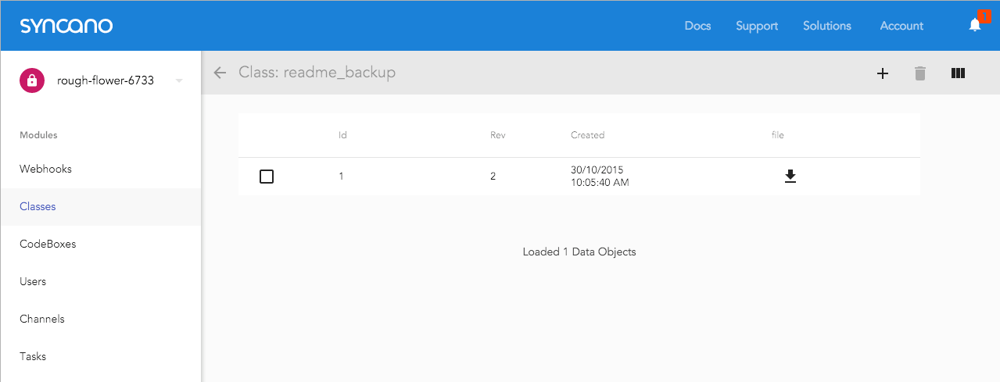
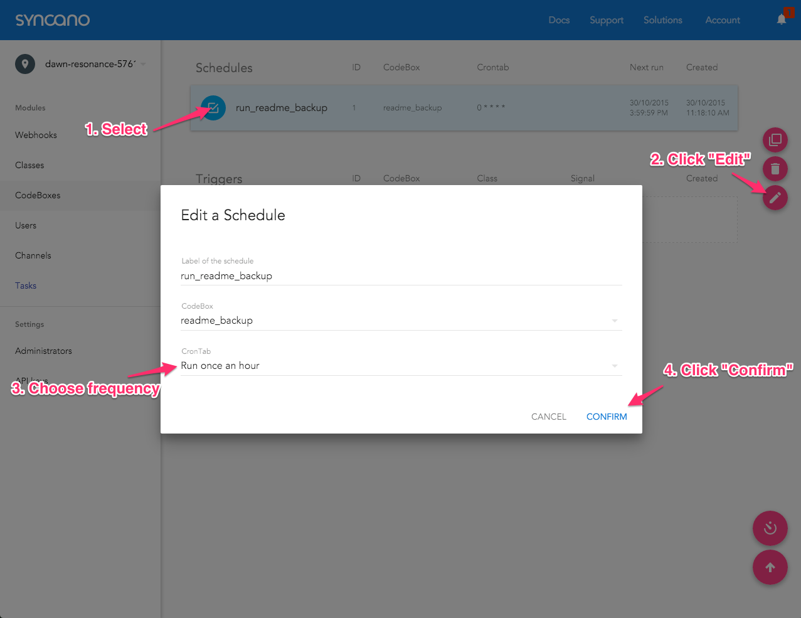
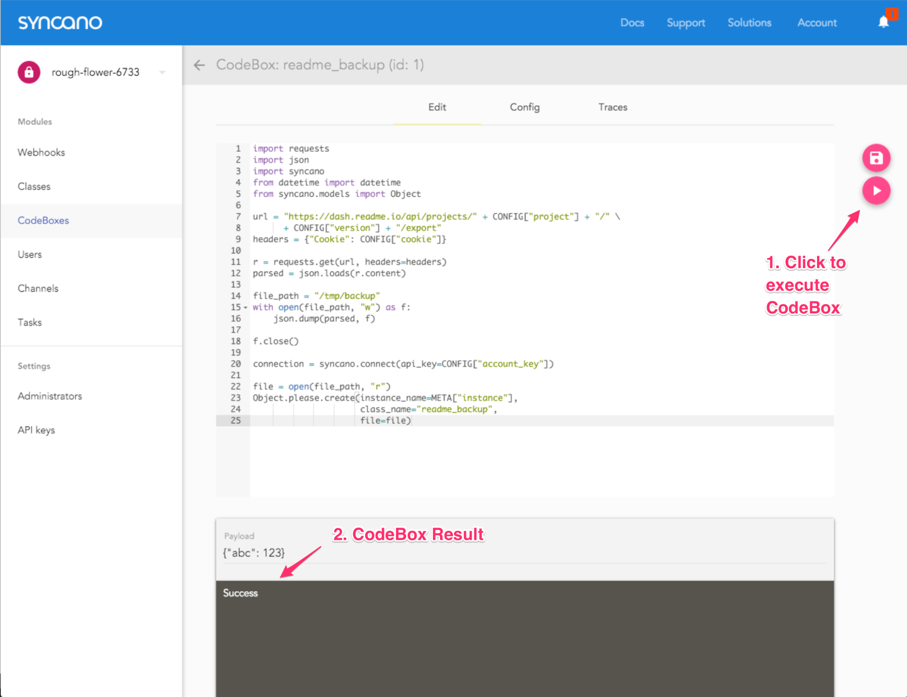
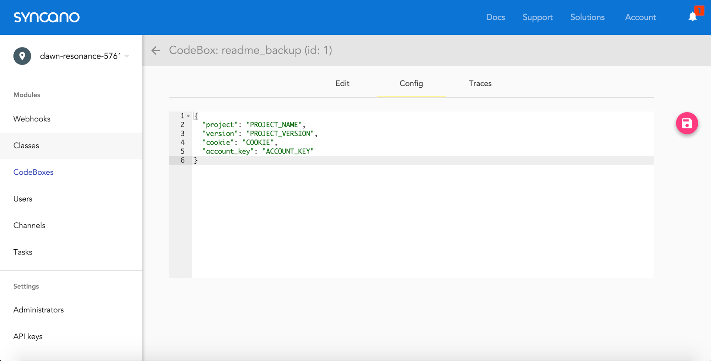
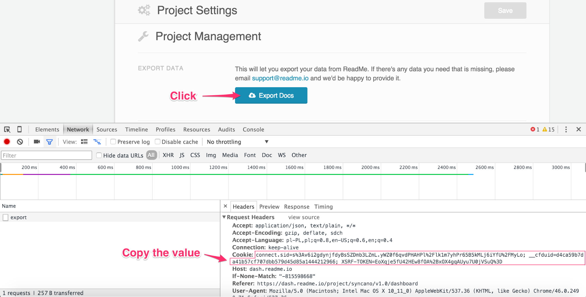

It’s not a secret that we are using ReadMe.io as our documentation tool. It’s a great product that makes it easy for the whole team to collaborate on the docs and keep them updated. What we found lacking, is the ability to automatically backup and retrieve the documentation whenever we wanted. Of course ReadMe.io is treating backups seriously and you can always contact them to get the backed up data for you but, since we are a data company, we decided that we’d take a shot at doing it with our own tools.

What’s more, we are sharing the solution with you, so that you can also do your own docs backup. So, without further ado, here is how to do it.

## Create a Syncano account and install a ReadMe.io backups Solution

1. First, you need to log in to your Syncano Dashboard, or create an account if you don’t yet have one. You can do this under this url:  dashboard.syncano.io
2. Once you’re in and have your first Instance created, go to this Solution url: https://dashboard.syncano.io/#/solutions/56/edit

A quick explanation here: Syncano Solutions are easy-to-install app templates that can significantly speed up the development process. In this case, we’ll be using Python scripts that will help us backup the data from ReadMe.io.

## Configuration

Once the Solution is installed, we’ll need to configure couple of things. First of all, we’ll need to get the Cookie that will enable the backup script to act as an authenticated user when getting the docs backup. To get it:

1. Go to the ReadMe dashboard. On the bottom of the project’s settings page you’ll find an “Export Docs” button.
2. Open the browser console (CMD + ALT + I on a Mac or CTRL + Shift + I  on Windows/Linux in Chrome Browser) on the network tab and click the “Export Docs” button.
3. Click on the request that was just made to get its details.
4. Copy the value of the Cookie from the “request headers” section



5. Once you have the Cookie, go back to your Syncano Dashboard. Go to the Config section of a CodeBox called “readme_backup”. This is how the screen should look:



6. Replace the “COOKIE” with the value you copied from ReadMe.io
7. Change “PROJECT_NAME” to the name of your documentation project on ReadMe.io
8. “PROJECT_VERSION” should be the version you would like to back up
9. “ACCOUNT_KEY” is your Syncano Account Key and can be found on this page

Ok. So we are done with the configuration part! After the changes, your config file should look more or less like this:



## Is it working?
Now, let’s test to see if the backups are working. Go to the “readme_backup” CodeBox edit tab and press the “Run CodeBox” button:



After a couple of seconds, the result screen should display “Success”. You can now go to Classes view to check if a Data Object with the docs backup was created. To do that:

1. Click on the “Classes” link in the left menu of the Dashboard
2. Click on the “readme_backup” Class on the Classes list

You should see a table with one row. This is a Data Object that stores your docs! You can click on the arrow to download the file or use the “get_docs_backup” CodeBox to retrieve the exact page you want (more on that later).



## Let’s make a backup schedule!

Ok, so we have a CodeBox code that will create backups, but what about scheduling? This code should be run periodically and do automated backups, right? Of course! That’s why the solution we installed has one more component -- a schedule. It can be found in the Tasks view. In order to enable it:

1. Select the “run_readme_backup” schedule
2. Click on the “edit” icon
3. Choose the time interval at which the backups should be made
4. Click the “Confirm” button to approve your changes


Now the “readme_backup” CodeBox will run according to the schedule that we just set up and will create a regular backups.

## Retrieving the Docs

Once you have the backups running, there might (hopefully not!) come a time when you’ll actually need to restore a docs page to a previous state. The Solution we’ve prepared comes with a CodeBox designed exactly for this purpose.

To restore one of the docs pages:

1. Go to the “readme_backup” Class and choose an ID of a Data Object that contains the backup that you’d like to restore
2. Go to the CodeBox list and choose “get_docs_backup” CodeBox to view its details
3. Go to the Config section and paste the Data Object ID and your Account Key (available here)
4. Go to the CodeBox edit screen

Here you’ll have to edit the code to get exactly what you want. You can check the versions by printing this line:

```python
print [docs[i]['version'] for i in xrange(len(docs))]
```


If you want to see the article titles in the first version and first category, uncomment the lines 22 and 23

```python
pages = len(docs[0]['categories'][0]["pages"])
print [docs[0]['categories'][0]['pages'][i]['title'] for i in xrange(pages)]
```

Now, when you know which page you want printed out, use the code from line 26 to print the correct page

```python
print docs[0]['categories'][0]['pages'][0]['body']
```

You’ll get the raw markdown documentation page. You can go to the ReadMe dashboard and choose the page you’d like to post the result to. Click on the cog icon next to the save button of this page and choose “Switch to raw mode”. Paste the result of the “get_docs_backup” CodeBox, click save, and enjoy your restored docs!

If you have any questions, don't hesitate to leave a comment or ask for help at [support@syncano.com](support@syncano.com).
