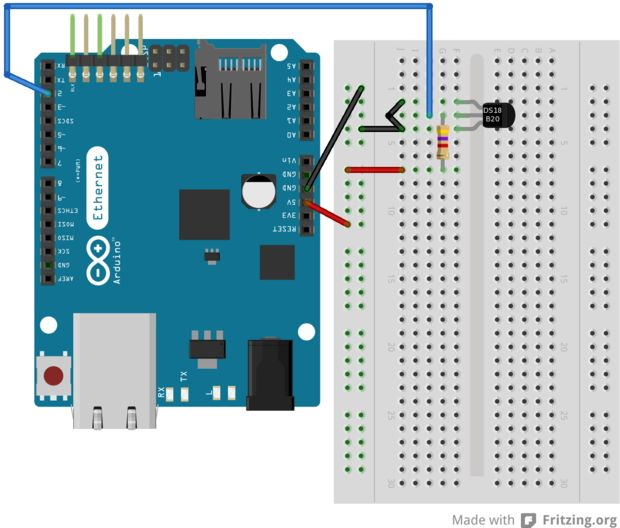

# Introduction to IoT with Syncano 

The Internet of Things is one of the most popular topics these days. Everyone is using a lot of different devices connected to the Internet, and synchronized with some type of cloud service. We all know how to connect a smartphone and laptop to a mailbox or any multimedia server, but what do we do when we want to check the temperature in our house while we’re working? We can use a simple embedded system, like Arduino, which is one of the most popular IoT platforms these days.

Arduino can be used for nearly anything. Usually, the biggest problems are data exchange and low memory capabilities.

Below I want to show another way of using Arduino. Let`s connect Arduino to a cloud service -- Syncano -- send basic data and voilà! You can use Syncano to parse, change, and do other stuff with data -- with high performance and no problems due to Aduino’s low memory cap.

Let's think about a simple weather station. We want to get the current temperature and humidity and keep it for weather history. In this case, we will use Syncano as the database and Arduino as the data logger. 

## Assembling the Weather Station 
All you need is Arduino Yun, a humidity & temperature sensor (for example` DHT11`), a 4.7kΩ resistor, and some connector wires. 

Now it's time to assemble your weather station. To do this, follow the schematics below. 

  

## Prepare Arduino for First Use
Due to the limitations of ATMega microcontrollers used by most Arduino boards, we can connect via HTTPS only with boards that have integrated a more powerful processor. A good choice is [Arduino Yun](https://www.arduino.cc/en/Main/ArduinoBoardYun), which has an additional Atheros AR9331 microprocessor with the Linino operation system installed.

Before you can start with coding, you have to connect your Yun to the Internet and prepare it for use with HTTPS. 

 - Connect Arduino to a WiFi Network
   - We recommend you follow a great guide directly from the Arduino website: [Configure WiFI Guide](https://www.arduino.cc/en/Guide/ArduinoYun#toc14)
  
 - Extend Storage for OpenWRT (Linux inside)
   - Follow a guide from the Arduino website: [Extend storage for OpenWRT](https://www.arduino.cc/en/Tutorial/ExpandingYunDiskSpace)

Now, connect to your Arduino and install SSL packages using the commands below:

```bash
  ssh root@arduino.local
  opkg update
  opkg install python-openssl
```

#### First Sketch
If you haven't installed Arduino IDE yet, download the newest version from [arduino.cc](https://www.arduino.cc/en/Main/Software).

When done, you can test your weather station with an example code from the DHT library, which you need to install first. Download it from [github repository](https://github.com/adafruit/DHT-sensor-library). In Arduino IDE, go to the menu and select: `Sketch -> Include Library -> Add .ZIP Library` and choose the downloaded file. Run `DHTtester` to see if everything works. 

## Prepare Syncano
Now, when all is assembled and tested, it's time to prepare a cloud Instance.

You have to create a Class, which will store your data. The Class name should be as simple as it can be, for example `temphum`. In this case, you need fields for the temperature and humidity values. Both sensors will return numbers like: `21.5`, `25.0`, `22.5` ... etc., so the variable type should be set to `FLOAT` on the temperature and humidity fields. Note that Arduino has only a few KB of memory, so long names are not recommended; good names for those fields would be: `temp` and `hum`.

## Writing an Arduino Sketch
### Using Bridge Commands on Yun
#### Prepare Data
In sketch, you have to prepare a cURL command that will send data to Syncano and receive an answer for each temperature or humidity change. First prepare the request body as a String with JSON format: 

```c++
String requestBody = "{\"temp\":\""+String(humidity)+"\",\"hum\":\""+String(temperature)+"\"}";
```

Next, create a URL: 

```c++
String INSTANCE_NAME = "YOUR_INSTANCE_NAME";
String CLASS_NAME = "YOUR_CLASS_NAME";
String url = "https://api.syncano.io/v1/instances/"+INSTANCE_NAME+"/classes/"+CLASS_NAME+"/objects/";
```

####Adding a New Data Object to Syncano
Now it's time to use the cURL command in a Linux shell, to send data to Syncano. The whole sequence for this example would be (this is still `C++` code):

```c++    
  Process p;
  p.begin("curl");
  p.addParameter("-X");
  p.addParameter("POST");
  p.addParameter("-H");
  p.addParameter("X-API-KEY:"+String(ACCOUNT_KEY));
  p.addParameter("-H");
  p.addParameter("Content-Type: application/json");
  p.addParameter("-d");
  p.addParameter(requestBody);
  p.addParameter(url);
  p.run();
```

####Receive Data
After sending a request, you need to read the response from Syncano. Use the code below to print JSON directly to the Arduino Serial output. 

```c++
  char c;
  while (p.available()>0) {
    c = p.read();
    Serial.print(c);
  }
```

### Using the Syncano Arduino Library
#### Install Library
Using Bridge commands works directly, but is complicated, hard to use, and useless until you want to decode JSON and parse the data.
 
But -- you can use the `Syncano Arduino Library` to avoid these problems! 

Download the [Syncano Arduino Library](https://github.com/eyedea-io/syncano-arduino-library/archive/devel.zip) and install it in the same way you installed the DHT Library. 

After adding it to your project sketch, you will have access to many functions that allow you to create local copies of class objects or channels. You can use them to communicate with Syncano.
 
#### Prepare Local Variables 
Initialize the Syncano Client with your API Key. Next, set your Instance name and Class name.

```c++
  initSyncanoClient(ACCOUNT_KEY);
  syncano = getSyncanoClient();
  syncano->setInstanceName(INSTANCE_NAME);
  syncano->setClassName(CLASS_NAME);
```

Create a local Class container, add needed fields, and then initialize it. At this point, you have a local Class, which can be synchronized with Syncano. Let's create an empty data object inside this Class.
 
```c++
  classContainer = new SyncanoClass(CLASS_NAME);
  classContainer->addField("temp");
  classContainer->addField("hum");
  classContainer->initClass();
  object = classContainer->initObject();
```

#### Adding a New Data Object to Syncano
We now have an empty data object with both fields empty. We want to update them when temperature or humidity change. To do so, you need to put the data from the sensor into the object fields and send it using the `add` method. It returns true if the operation was successful on the Syncano side, or false in any other case.  

```c++
  object->setFieldValue("temp",String(temperature,2));
  object->setFieldValue("hum",String(humidity,2));
  bool created = object->add();
```

## Summary
That's it! You do not have to worry about cURL parameters or JSON decode, our library will do it for you. 

For more complete tutorials, please visit the [IoT Playground](http://eyedea.ninja/) site.

For more detailed information about the library, visit the [documentation](http://docs.eyedea.ninja/) site.


